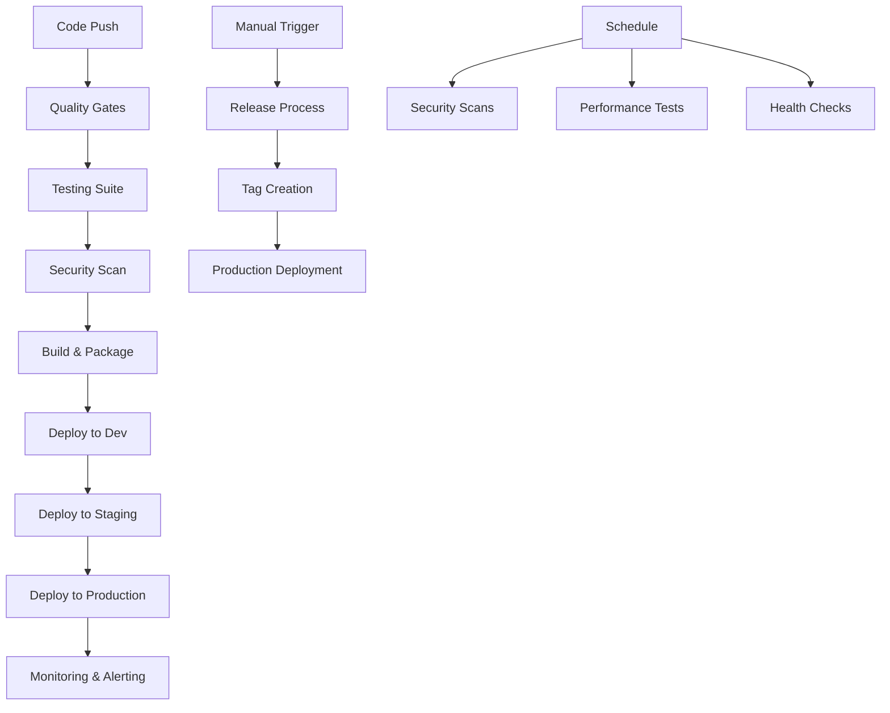

# 🚀 HASEB GitHub Actions Workflows

This directory contains all the GitHub Actions workflows for the HASEB project, implementing a comprehensive CI/CD pipeline with automated testing, security scanning, deployment, and monitoring.

## 📁 Workflow Files Overview

### Main CI/CD Pipeline
- **[ci-cd.yml](./ci-cd.yml)** - Main CI/CD pipeline with testing, building, and deployment

### Quality & Testing
- **[code-quality.yml](./code-quality.yml)** - Code quality automation and analysis
- **[testing.yml](./testing.yml)** - Comprehensive testing suite (unit, integration, E2E)
- **[database.yml](./database.yml)** - Database migrations and infrastructure automation

### Release & Deployment
- **[release.yml](./release.yml)** - Automated releases with semantic versioning
- **[deploy.yml](./deploy.yml)** - Multi-environment deployment management

### Security & Monitoring
- **[security.yml](./security.yml)** - Security scanning and vulnerability detection
- **[monitoring.yml](./monitoring.yml)** - Application monitoring and alerting

## 🔄 Workflow Triggers

| Workflow | Triggers | Purpose |
|----------|----------|---------|
| `ci-cd.yml` | Push to main/develop, PR | Main CI/CD pipeline |
| `code-quality.yml` | Push, PR, Daily | Code quality checks |
| `testing.yml` | Push, PR, Daily | Comprehensive testing |
| `release.yml` | Push to main, Manual | Automated releases |
| `database.yml` | DB changes, Manual | Database operations |
| `security.yml` | Push, PR, Daily | Security scanning |
| `monitoring.yml` | Push, Schedule, Manual | Application monitoring |
| `deploy.yml` | Push, Tags, Manual | Environment deployments |

## 🏗️ Architecture



## 🔧 Configuration Requirements

### Required Secrets

```yaml
# Registry & Deployment
GITHUB_TOKEN: Automatically provided
DOCKER_REGISTRY: Container registry credentials
DEPLOY_SSH_KEY: SSH key for server deployment

# Database & Services
DATABASE_URL: Production database connection
TEST_DATABASE_URL: Test database connection
REDIS_URL: Redis connection string

# Security & Monitoring
SNYK_TOKEN: Snyk security scanning
SLACK_WEBHOOK_URL: Slack notifications
SENTRY_DSN: Error tracking

# External Services
PERCY_TOKEN: Visual testing
AWS_ACCESS_KEY_ID: AWS credentials
CODEQL_TOKEN: CodeQL analysis
```

### Environment Variables

```yaml
# Application
NODE_VERSION: '20'
REGISTRY: ghcr.io
IMAGE_NAME: ${{ github.repository }}

# Quality Gates
COVERAGE_THRESHOLD: 80
QUALITY_SCORE_THRESHOLD: 80
SECURITY_SCORE_THRESHOLD: 70

# Performance
RESPONSE_TIME_THRESHOLD: 3000
AVAILABILITY_THRESHOLD: 99
```

## 🚀 Deployment Flow

### Development Environment
- **Trigger**: Push to `develop` branch
- **Process**: Build → Test → Deploy to Development
- **URL**: `https://dev.haseb.example.com`
- **Rollback**: Automatic on failure

### Staging Environment
- **Trigger**: Push to `main` branch, Manual
- **Process**: Build → Full Test Suite → Deploy to Staging
- **URL**: `https://staging.haseb.example.com`
- **Requirements**: All tests must pass

### Production Environment
- **Trigger**: Manual approval, Version tags
- **Process**: Comprehensive validation → Canary deployment → Full rollout
- **URL**: `https://haseb.example.com`
- **Requirements**: All checks pass, team approval

## 📊 Monitoring & Alerting

### Monitoring Dashboards
- **Performance**: Response times, error rates, throughput
- **Infrastructure**: CPU, memory, disk, network usage
- **Security**: Vulnerability counts, security scores
- **Business**: User metrics, feature usage

### Alert Channels
- **Slack**: #deployments, #alerts, #security
- **Email**: Team notifications
- **GitHub**: Status checks, PR comments
- **PagerDuty**: Critical incidents

## 🔒 Security Features

- **Static Analysis**: CodeQL, Semgrep, ESLint security rules
- **Dependency Scanning**: npm audit, Snyk dependency analysis
- **Container Security**: Trivy image scanning
- **Infrastructure Security**: Terraform security validation
- **Web Security**: OWASP ZAP, Nikto scanning
- **Secret Detection**: Automated secret scanning

## 📈 Quality Gates

### Code Quality
- **ESLint**: No errors, < 10 warnings
- **TypeScript**: 100% type safety
- **Prettier**: Consistent formatting
- **Coverage**: > 80% line coverage

### Security
- **Critical Vulnerabilities**: 0 allowed
- **High Severity**: Minimized
- **Security Score**: > 70/100

### Performance
- **Response Time**: < 3000ms average
- **Availability**: > 99%
- **Error Rate**: < 1%

## 🛠️ Troubleshooting

### Common Issues
1. **Build Failures**: Check dependencies, Node.js version
2. **Test Failures**: Review test logs, check environment setup
3. **Deployment Failures**: Verify credentials, check service health
4. **Security Issues**: Update dependencies, fix code security issues

### Debug Commands
```bash
# Check workflow status
gh run list --repo $REPO --limit 10

# View workflow logs
gh run view --repo $REPO --log $RUN_ID

# Download artifacts
gh run download --repo $REPO --run $RUN_ID

# Trigger manual workflow
gh workflow run workflow_name.yml
```

## 📚 Documentation

- **[Main Documentation](../../docs/ci-cd/README.md)**: Comprehensive CI/CD guide
- **[Troubleshooting Guide](../../docs/ci-cd/TROUBLESHOOTING.md)**: Step-by-step troubleshooting
- **[Quick Start Guide](../../docs/ci-cd/QUICK_START.md)**: Get started quickly

## 🔄 Workflow Updates

### Adding New Workflows
1. Create new workflow file in this directory
2. Follow naming convention: `purpose.yml`
3. Include proper triggers and jobs
4. Add documentation to this README
5. Update main documentation

### Modifying Existing Workflows
1. Test changes in a feature branch
2. Ensure backward compatibility
3. Update documentation
4. Communicate changes to team
5. Monitor for issues

## 📞 Support

For workflow issues:
- **Documentation**: Check `/docs/ci-cd/`
- **Team Communication**: Slack #devops
- **Issue Tracking**: GitHub Issues with `ci-cd` label
- **Emergency**: Contact on-call DevOps engineer

---

*Last updated: $(date +%Y-%m-%d)*
*Version: 1.0.0*