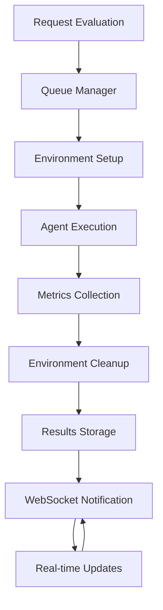
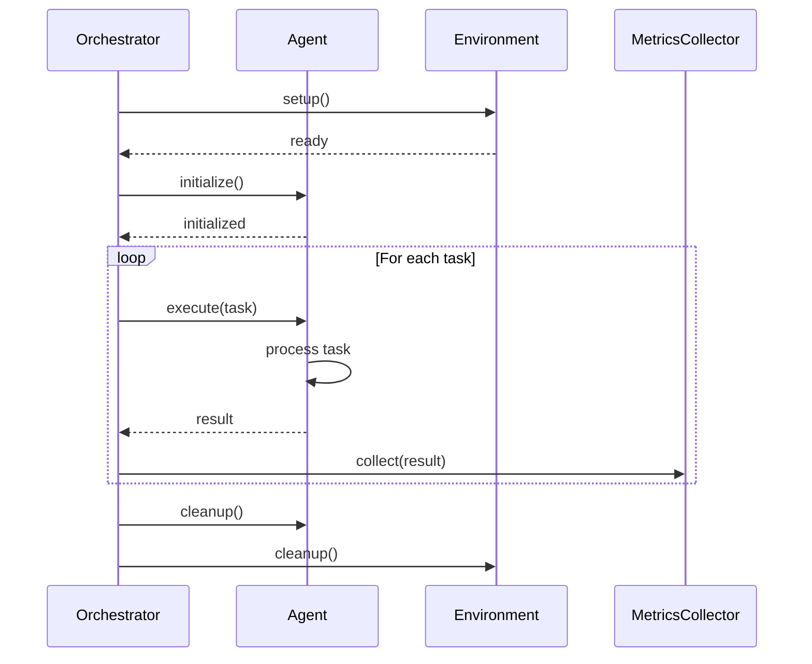

# HASEB Architecture Documentation

This document provides a comprehensive overview of the HASEB (Holistic Agentic System Evaluator & Benchmarking Suite) architecture, including system components, data flows, and design patterns.

## 📋 Table of Contents

- [System Overview](#system-overview)
- [High-Level Architecture](#high-level-architecture)
- [Core Components](#core-components)
- [Data Flow Architecture](#data-flow-architecture)
- [Database Schema](#database-schema)
- [API Architecture](#api-architecture)
- [Frontend Architecture](#frontend-architecture)
- [Evaluation Orchestration](#evaluation-orchestration)
- [Agent Architecture](#agent-architecture)
- [Metrics Collection System](#metrics-collection-system)
- [Security Architecture](#security-architecture)
- [Scalability Design](#scalability-design)
- [Technology Stack](#technology-stack)
- [Development Patterns](#development-patterns)

## 🌐 System Overview

HASEB is a comprehensive evaluation platform designed to assess AI agents across multiple dimensions. The system follows a modular, microservices-inspired architecture with clear separation of concerns.

### Design Principles

1. **Modularity**: Each component is independently deployable and testable
2. **Scalability**: Horizontal scaling support through stateless services
3. **Observability**: Comprehensive logging, metrics, and tracing
4. **Extensibility**: Plugin architecture for new benchmarks and agents
5. **Reliability**: Error handling, retries, and graceful degradation

### System Boundaries

```
┌─────────────────────────────────────────────────────────────────┐
│                        HASEB System                            │
├─────────────────────────────────────────────────────────────────┤
│  Frontend (React)    │   Backend API (Express)   │  Database    │
│  - Dashboard UI      │   - REST Endpoints       │  PostgreSQL  │
│  - Real-time Updates │   - WebSocket Server      │  - Metadata  │
│  - Visualization    │   - Authentication        │  - Metrics   │
└─────────────────────────────────────────────────────────────────┘
                              │
                    ┌─────────────────┐
                    │   External      │
                    │   Integrations  │
                    │                 │
                    │ - OpenAI API    │
                    │ - Anthropic API │
                    │ - Benchmark     │
                    │   Data Sources  │
                    └─────────────────┘
```

## 🏗️ High-Level Architecture

### Three-Tier Architecture

```
┌─────────────────────────────────────────────────────────────────┐
│                      Presentation Layer                         │
├─────────────────────────────────────────────────────────────────┤
│  React Dashboard                                              │
│  - Interactive Charts                                          │
│  - Real-time Monitoring                                        │
│  - Agent & Benchmark Management                                │
└─────────────────────────────────────────────────────────────────┘
                              │
                              ▼
┌─────────────────────────────────────────────────────────────────┐
│                       Application Layer                         │
├─────────────────────────────────────────────────────────────────┤
│  Express API Server                                            │
│  - REST Endpoints                                             │
│  - WebSocket Server                                           │
│  - Authentication & Authorization                              │
│  - Request Validation                                         │
└─────────────────────────────────────────────────────────────────┘
                              │
                              ▼
┌─────────────────────────────────────────────────────────────────┐
│                        Data Layer                              │
├─────────────────────────────────────────────────────────────────┤
│  PostgreSQL Database                                          │
│  - Evaluation Results                                         │
│  - Agent & Benchmark Definitions                              │
│  - User Data & Authentication                                 │
│  - Metrics & Analytics                                        │
└─────────────────────────────────────────────────────────────────┘
```

### Component Architecture

```
┌─────────────────────────────────────────────────────────────────┐
│                     HASEB Core System                          │
├─────────────────────────────────────────────────────────────────┤
│  ┌─────────────┐  ┌─────────────┐  ┌─────────────┐  ┌─────────┐ │
│  │   Agents    │  │ Benchmarks  │  │Evaluations │  │ Metrics │ │
│  │   Service   │  │   Service   │  │   Service   │  │ Service │ │
│  └─────────────┘  └─────────────┘  └─────────────┘  └─────────┘ │
│                                                                   │
│  ┌─────────────────────────────────────────────────────────────┐ │
│  │              Evaluation Orchestrator                        │ │
│  │  ┌─────────────┐  ┌─────────────┐  ┌─────────────────┐  │ │
│  │  │ Environment │  │   Queue     │  │  WebSocket       │  │ │
│  │  │  Manager    │  │  Manager    │  │    Manager       │  │ │
│  │  └─────────────┘  └─────────────┘  └─────────────────┘  │ │
│  └─────────────────────────────────────────────────────────────┘ │
│                                                                   │
│  ┌─────────────────────────────────────────────────────────────┐ │
│  │                  Agent Execution Engine                       │ │
│  │  ┌─────────────┐  ┌─────────────┐  ┌─────────────────┐  │ │
│  │  │ SWE-Bench    │  │ GUI         │  │ General          │  │ │
│  │  │   Agent     │  │ Automation  │  │ Reasoning       │  │ │
│  │  │             │  │   Agent     │  │     Agent        │  │ │
│  │  └─────────────┘  └─────────────┘  └─────────────────┘  │ │
│  └─────────────────────────────────────────────────────────────┘ │
└─────────────────────────────────────────────────────────────────┘
```

## 🔧 Core Components

### 1. Backend API Server (`src/server.ts`)

**Responsibilities:**
- HTTP request handling and routing
- WebSocket connection management
- Middleware orchestration (CORS, rate limiting, authentication)
- Error handling and logging
- Graceful shutdown

**Key Features:**
```typescript
// Express server with comprehensive middleware
app.use(helmet());           // Security headers
app.use(cors());              // Cross-origin requests
app.use(compression());       // Response compression
app.use(rateLimit());         // Rate limiting
app.use(morgan('combined'));  // Request logging

// WebSocket support
const server = createHttpServer(app);
wsManager.initialize(server);
```

### 2. Evaluation Orchestrator (`src/orchestrator/`)

**Components:**
- **EvaluationOrchestrator**: Main workflow coordinator
- **EnvironmentManager**: Setup/teardown of evaluation environments
- **EvaluationQueue**: Task queue management and prioritization
- **WebSocketManager**: Real-time progress updates
- **ExecutionEngine**: Agent execution coordination

**Workflow Architecture:**


### 3. Agent Execution Engine (`src/agents/`)

**Agent Types:**
- **SWE_Bench_Agent**: Software engineering tasks
- **GUI_Automation_Agent**: Desktop/web automation
- **General_Reasoning_Agent**: Multi-domain reasoning

**Base Architecture:**
```typescript
abstract class BaseExecutionAgent {
  abstract async execute(task: Task): Promise<AgentResult>;
  abstract async initialize(): Promise<void>;
  abstract async cleanup(): Promise<void>;

  protected collectMetrics(result: AgentResult): AgentMetrics {
    // Common metrics collection logic
  }
}
```

### 4. Metrics Collection System (`src/services/metrics/`)

**Metrics Dimensions:**
- **Performance**: Task success rate, execution time
- **Efficiency**: Token usage, step count, latency
- **Cost**: API costs, resource utilization
- **Robustness**: Error rates, recovery mechanisms
- **Quality**: Tool selection accuracy, parameter precision

**Collector Architecture:**
```typescript
interface MetricCollector {
  collect(execution: Execution): MetricsData;
  validate(data: MetricsData): boolean;
  aggregate(data: MetricsData[]): AggregatedMetrics;
}

class PerformanceMetricsCollector implements MetricCollector {
  collect(execution: Execution): PerformanceMetrics {
    return {
      taskSuccessRate: this.calculateSuccessRate(execution),
      executionTime: execution.endTime - execution.startTime,
      firstSuccessTime: this.getFirstSuccessTime(execution)
    };
  }
}
```

## 📊 Database Schema

### Entity Relationship Diagram

```
┌─────────────┐    ┌─────────────┐    ┌─────────────┐
│    Users    │    │    Agents   │    │ Benchmarks  │
├─────────────┤    ├─────────────┤    ├─────────────┤
│ id (PK)     │    │ id (PK)     │    │ id (PK)     │
│ email       │    │ name        │    │ name        │
│ username    │    │ type        │    │ type        │
│ password_hash│    │ description │    │ description │
│ role        │    │ capabilities│    │ dataset     │
│ created_at  │    │ configuration│   │ criteria    │
│ updated_at  │    │ status      │    │ config      │
└─────────────┘    │ created_at  │    │ is_active   │
                   │ updated_at  │    │ created_at  │
                   └─────────────┘    │ updated_at  │
                                      └─────────────┘
                           │                   │
                           │                   │
                           ▼                   ▼
                   ┌─────────────────────────────────┐
                   │          Evaluations          │
                   ├─────────────────────────────────┤
                   │ id (PK)                       │
                   │ agent_id (FK)                 │
                   │ benchmark_id (FK)              │
                   │ status                        │
                   │ start_time                    │
                   │ end_time                      │
                   │ metrics (JSONB)                │
                   │ logs (JSONB)                  │
                   │ configuration (JSONB)          │
                   │ created_at                    │
                   │ updated_at                    │
                   └─────────────────────────────────┘
                           │
                           │
                           ▼
                   ┌─────────────────────────────────┐
                   │            Tasks               │
                   ├─────────────────────────────────┤
                   │ id (PK)                       │
                   │ evaluation_id (FK)             │
                   │ type                          │
                   │ description                   │
                   │ input (JSONB)                 │
                   │ expected_output (JSONB)        │
                   │ actual_output (JSONB)         │
                   │ status                        │
                   │ execution_time                │
                   │ tokens_used                   │
                   │ errors (JSONB)                │
                   │ created_at                    │
                   │ updated_at                    │
                   └─────────────────────────────────┘
```

### Schema Design Principles

1. **Normalization**: Proper foreign key relationships
2. **JSONB Usage**: Flexible data storage for metrics and configurations
3. **Indexing Strategy**: Optimized for common query patterns
4. **Audit Trail**: Created/updated timestamps on all entities

### Key Indexes

```sql
-- Performance critical indexes
CREATE INDEX idx_evaluations_agent_id ON evaluations(agent_id);
CREATE INDEX idx_evaluations_benchmark_id ON evaluations(benchmark_id);
CREATE INDEX idx_evaluations_status_created ON evaluations(status, created_at);
CREATE INDEX idx_evaluations_metrics ON evaluations USING GIN(metrics);

-- Agent search optimization
CREATE INDEX idx_agents_type_status ON agents(type, status);
CREATE INDEX idx_agents_capabilities ON agents USING GIN(capabilities);

-- Task performance
CREATE INDEX idx_tasks_evaluation_status ON tasks(evaluation_id, status);
CREATE INDEX idx_tasks_execution_time ON tasks(execution_time);
```

## 🌐 API Architecture

### RESTful Design Principles

1. **Resource-Based URLs**: `/api/agents/{id}`, `/api/evaluations/{id}`
2. **HTTP Methods**: GET (retrieve), POST (create), PUT (update), DELETE (remove)
3. **Status Codes**: Proper HTTP status code usage
4. **Content Negotiation**: JSON request/response format

### API Endpoint Organization

```
/api/
├── auth/                 # Authentication endpoints
│   ├── login
│   ├── register
│   ├── refresh
│   └── logout
├── agents/               # Agent management
│   ├── GET    /          # List agents
│   ├── POST   /          # Create agent
│   ├── GET    /{id}      # Get agent
│   ├── PUT    /{id}      # Update agent
│   ├── DELETE /{id}      # Delete agent
│   ├── PATCH  /{id}/status
│   └── GET    /search
├── benchmarks/           # Benchmark management
│   ├── GET    /
│   ├── POST   /
│   ├── GET    /{id}
│   ├── PUT    /{id}
│   └── DELETE /{id}
├── evaluations/          # Evaluation management
│   ├── GET    /
│   ├── POST   /
│   ├── GET    /{id}
│   ├── PATCH  /{id}/status
│   ├── PUT    /{id}/metrics
│   ├── POST   /{id}/logs
│   └── DELETE /{id}
├── metrics/              # Metrics and analytics
│   ├── GET    /dashboard
│   ├── GET    /performance
│   ├── GET    /leaderboard
│   └── GET    /agents/{id}
└── orchestrator/         # Workflow orchestration
    ├── POST   /evaluations/start
    ├── POST   /evaluations/{id}/stop
    ├── GET    /queue/status
    └── GET    /status
```

### Request/Response Patterns

**Standard Response Format:**
```typescript
interface ApiResponse<T = any> {
  success: boolean;
  data?: T;
  error?: {
    code: string;
    message: string;
    details?: any;
  };
  metadata?: {
    timestamp: Date;
    requestId?: string;
    version?: string;
  };
}
```

**Error Handling Pattern:**
```typescript
// Middleware error handler
app.use((err: Error, req: Request, res: Response, next: NextFunction) => {
  const errorResponse: ApiResponse = {
    success: false,
    error: {
      code: err.name || 'INTERNAL_ERROR',
      message: err.message,
    },
    metadata: {
      timestamp: new Date(),
      requestId: req.headers['x-request-id'] as string,
    },
  };

  logger.error('API Error:', err);
  res.status(500).json(errorResponse);
});
```

## 🎨 Frontend Architecture

### React Component Architecture

```
src/
├── components/           # Reusable UI components
│   ├── common/          # Generic components
│   ├── charts/          # Data visualization
│   └── forms/           # Form components
├── pages/               # Route-level components
│   ├── DashboardPage.tsx
│   ├── AgentsPage.tsx
│   ├── BenchmarksPage.tsx
│   └── AnalyticsPage.tsx
├── hooks/               # Custom React hooks
│   ├── useRealTimeUpdates.ts
│   ├── useLocalStorage.ts
│   └── useApi.ts
├── store/               # State management
│   ├── useDashboardStore.ts
│   └── useAuthStore.ts
├── services/            # API communication
│   └── api.ts
└── utils/               # Utility functions
    └── helpers.ts
```

### State Management Strategy

**Zustand Store Pattern:**
```typescript
interface DashboardStore {
  // State
  agents: Agent[];
  evaluations: Evaluation[];
  metrics: DashboardMetrics;
  isLoading: boolean;
  error: string | null;

  // Actions
  fetchAgents: () => Promise<void>;
  fetchEvaluations: () => Promise<void>;
  startEvaluation: (config: EvaluationConfig) => Promise<void>;

  // Real-time updates
  updateEvaluation: (evaluation: Evaluation) => void;
  addAgent: (agent: Agent) => void;
}
```

### Real-time Updates Architecture

**WebSocket Integration:**
```typescript
const useRealTimeUpdates = () => {
  const [socket, setSocket] = useState<WebSocket | null>(null);
  const store = useDashboardStore();

  useEffect(() => {
    const ws = new WebSocket('ws://localhost:3000');

    ws.onmessage = (event) => {
      const message = JSON.parse(event.data);

      switch (message.type) {
        case 'evaluation_update':
          store.updateEvaluation(message.data);
          break;
        case 'agent_status':
          store.updateAgentStatus(message.data);
          break;
      }
    };

    setSocket(ws);
    return () => ws.close();
  }, []);

  return socket;
};
```

## 🔄 Evaluation Orchestration

### LangGraph Workflow Architecture

```typescript
const evaluationGraph = new StateGraph(EvaluationState)
  .addNode("setup", setupEnvironment)
  .addNode("execute", executeTask)
  .addNode("collect", collectMetrics)
  .addNode("analyze", analyzeResults)
  .addNode("teardown", cleanupEnvironment)
  .addEdge("setup", "execute")
  .addEdge("execute", "collect")
  .addEdge("collect", "analyze")
  .addEdge("analyze", "teardown")
  .setEntryPoint("setup")
  .setFinishPoint("teardown");
```

### State Management

```typescript
interface EvaluationState {
  // Configuration
  agentId: string;
  benchmarkId: string;
  configuration: EvaluationConfig;

  // Runtime state
  currentStep: EvaluationStep;
  progress: number;
  startTime?: Date;
  endTime?: Date;

  // Results
  results?: EvaluationResults;
  metrics?: EvaluationMetrics;
  logs: EvaluationLog[];

  // Error handling
  error?: Error;
  retryCount: number;
}
```

### Environment Management

```typescript
class EnvironmentManager {
  async setup(environment: EnvironmentConfig): Promise<Environment> {
    // 1. Create isolated environment
    // 2. Install dependencies
    // 3. Configure runtime
    // 4. Validate setup
  }

  async cleanup(environment: Environment): Promise<void> {
    // 1. Stop running processes
    // 2. Clean temporary files
    // 3. Release resources
    // 4. Dispose environment
  }
}
```

## 🤖 Agent Architecture

### Agent Interface Definition

```typescript
interface Agent {
  // Core information
  id: string;
  name: string;
  type: AgentType;
  description: string;
  capabilities: string[];

  // Configuration
  configuration: AgentConfiguration;
  status: AgentStatus;

  // Execution interface
  initialize(): Promise<void>;
  execute(task: Task): Promise<AgentResult>;
  cleanup(): Promise<void>;

  // Monitoring
  getMetrics(): AgentMetrics;
  getStatus(): AgentStatus;
}
```

### Agent Execution Flow



### Specialized Agent Implementations

**SWE-Bench Agent:**
```typescript
class SWEBenchAgent extends BaseExecutionAgent {
  async execute(task: CodeTask): Promise<CodeResult> {
    // 1. Analyze task requirements
    // 2. Generate code solution
    // 3. Test the solution
    // 4. Refine if necessary
    // 5. Return final result
  }

  private async generateCode(task: CodeTask): Promise<string> {
    // LLM-based code generation
  }

  private async testCode(code: string, tests: TestCase[]): Promise<TestResult> {
    // Execute tests in isolated environment
  }
}
```

## 📈 Metrics Collection System

### Multi-Dimensional Metrics Architecture

```typescript
interface MetricsSystem {
  // Collectors for each dimension
  performance: PerformanceMetricsCollector;
  efficiency: EfficiencyMetricsCollector;
  cost: CostMetricsCollector;
  robustness: RobustnessMetricsCollector;
  quality: QualityMetricsCollector;

  // Orchestration
  orchestrator: MetricsOrchestrator;

  // Storage
  storage: MetricsStorage;

  // Analysis
  analyzer: MetricsAnalyzer;
}
```

### Real-time Metrics Collection

```typescript
class MetricsOrchestrator {
  async collectMetrics(execution: Execution): Promise<CompleteMetrics> {
    const collectors = [
      this.performanceCollector,
      this.efficiencyCollector,
      this.costCollector,
      this.robustnessCollector,
      this.qualityCollector,
    ];

    const results = await Promise.allSettled(
      collectors.map(collector => collector.collect(execution))
    );

    return this.aggregateResults(results);
  }

  private aggregateResults(results: PromiseSettledResult<MetricsData>[]): CompleteMetrics {
    // Combine metrics from all collectors
  }
}
```

### Metrics Storage Strategy

```sql
-- Time-series metrics storage
CREATE TABLE metrics_time_series (
  id UUID PRIMARY KEY DEFAULT gen_random_uuid(),
  evaluation_id UUID REFERENCES evaluations(id),
  metric_type VARCHAR(50) NOT NULL,
  metric_name VARCHAR(100) NOT NULL,
  metric_value NUMERIC NOT NULL,
  timestamp TIMESTAMP WITH TIME ZONE DEFAULT NOW(),
  metadata JSONB DEFAULT '{}'
);

-- Optimized for time-series queries
CREATE INDEX idx_metrics_time_series_type_timestamp ON metrics_time_series(metric_type, timestamp);
CREATE INDEX idx_metrics_time_series_evaluation ON metrics_time_series(evaluation_id);
```

## 🔒 Security Architecture

### Authentication & Authorization

```typescript
// JWT-based authentication
interface AuthSystem {
  // Authentication
  authenticate(email: string, password: string): Promise<AuthResult>;
  refreshToken(refreshToken: string): Promise<TokenPair>;
  logout(token: string): Promise<void>;

  // Authorization
  authorize(token: string, resource: string, action: string): Promise<boolean>;
  hasRole(user: User, role: Role): boolean;
  hasPermission(user: User, permission: Permission): boolean;
}
```

### Security Middleware Stack

```typescript
// Security layers in order of execution
app.use(helmet());                    // Security headers
app.use(cors(corsOptions));           // Cross-origin restrictions
app.use(rateLimit(limiterOptions));   // Rate limiting
app.use(authMiddleware);              // JWT validation
app.use(permissionMiddleware);        // RBAC authorization
app.use(validationMiddleware);        // Input validation
app.use(auditMiddleware);            // Action logging
```

### Data Protection

```typescript
// Sensitive data handling
class DataProtection {
  // Encryption
  encryptSensitiveData(data: string): string;
  decryptSensitiveData(encrypted: string): string;

  // PII anonymization
  anonymizePII(data: any): any;

  // Audit logging
  logDataAccess(user: User, resource: string, action: string): void;
}
```

## 📏 Scalability Design

### Horizontal Scaling Strategy

1. **Stateless API Servers**: Multiple instances behind load balancer
2. **Database Read Replicas**: Read queries distributed across replicas
3. **Caching Layer**: Redis for frequently accessed data
4. **Queue System**: Asynchronous task processing
5. **Microservice Boundaries**: Separate services for different domains

### Caching Architecture

```typescript
interface CacheSystem {
  // Multi-level caching
  l1Cache: MemoryCache;      // Application memory
  l2Cache: RedisCache;       // Distributed cache
  l3Cache: DatabaseCache;    // Query result caching

  // Cache strategies
  get<T>(key: string): Promise<T | null>;
  set<T>(key: string, value: T, ttl?: number): Promise<void>;
  invalidate(pattern: string): Promise<void>;
}
```

### Load Balancing

```yaml
# Example docker-compose for scaling
version: '3.8'
services:
  api:
    image: haseb:latest
    deploy:
      replicas: 3
    environment:
      - NODE_ENV=production
    ports:
      - "3000-3002:3000"

  nginx:
    image: nginx:alpine
    ports:
      - "80:80"
    volumes:
      - ./nginx.conf:/etc/nginx/nginx.conf
```

## 🛠️ Technology Stack

### Backend Technologies

| Component | Technology | Version | Purpose |
|-----------|------------|---------|---------|
| Runtime | Node.js | 18+ | JavaScript runtime |
| Framework | Express | 5.x | Web server framework |
| Language | TypeScript | 5.9+ | Type-safe JavaScript |
| Database | PostgreSQL | 15+ | Primary data store |
| ORM | Custom | - | Database abstraction |
| Auth | JWT | - | Stateless authentication |
| WebSocket | ws | 8.x | Real-time communication |
| Queue | In-memory | - | Task queuing (future: Redis) |

### Frontend Technologies

| Component | Technology | Version | Purpose |
|-----------|------------|---------|---------|
| Framework | React | 19.x | UI framework |
| Language | TypeScript | 5.9+ | Type-safe JavaScript |
| State | Zustand | 5.x | State management |
| Routing | React Router | 7.x | Client-side routing |
| HTTP | Fetch API | - | API communication |
| Charts | Chart.js | 4.x | Data visualization |
| Styling | Tailwind CSS | 4.x | Utility-first CSS |

### Development Tools

| Tool | Technology | Version | Purpose |
|------|------------|---------|---------|
| Build | Vite | 7.x | Build tool |
| Testing | Jest | 29.x | Unit/integration tests |
| E2E | Playwright | 1.x | End-to-end tests |
| Linting | ESLint | 8.x | Code linting |
| Formatting | Prettier | 3.x | Code formatting |
| CI/CD | GitHub Actions | - | Continuous integration |

## 🎯 Development Patterns

### Error Handling Pattern

```typescript
// Result pattern for error handling
type Result<T, E = Error> =
  | { success: true; data: T }
  | { success: false; error: E };

// Usage in services
async function createAgent(data: AgentData): Promise<Result<Agent>> {
  try {
    const agent = await AgentModel.create(data);
    return { success: true, data: agent };
  } catch (error) {
    logger.error('Failed to create agent:', error);
    return { success: false, error: error as Error };
  }
}
```

### Repository Pattern

```typescript
interface Repository<T> {
  findById(id: string): Promise<T | null>;
  findMany(filter: any): Promise<T[]>;
  create(data: Partial<T>): Promise<T>;
  update(id: string, data: Partial<T>): Promise<T | null>;
  delete(id: string): Promise<boolean>;
}

class AgentRepository implements Repository<Agent> {
  async findById(id: string): Promise<Agent | null> {
    const result = await db.query('SELECT * FROM agents WHERE id = $1', [id]);
    return result.rows[0] || null;
  }

  // ... other methods
}
```

### Observer Pattern for Real-time Updates

```typescript
interface Observer<T> {
  update(data: T): void;
}

interface Subject<T> {
  subscribe(observer: Observer<T>): void;
  unsubscribe(observer: Observer<T>): void;
  notify(data: T): void;
}

class EvaluationSubject implements Subject<Evaluation> {
  private observers: Observer<Evaluation>[] = [];

  subscribe(observer: Observer<Evaluation>): void {
    this.observers.push(observer);
  }

  notify(evaluation: Evaluation): void {
    this.observers.forEach(observer => observer.update(evaluation));
  }
}
```

### Factory Pattern for Agent Creation

```typescript
interface AgentFactory {
  createAgent(type: AgentType, config: AgentConfig): Agent;
}

class ConcreteAgentFactory implements AgentFactory {
  createAgent(type: AgentType, config: AgentConfig): Agent {
    switch (type) {
      case 'swe':
        return new SWEBenchAgent(config);
      case 'gui':
        return new GUIAutomationAgent(config);
      case 'general':
        return new GeneralReasoningAgent(config);
      default:
        throw new Error(`Unknown agent type: ${type}`);
    }
  }
}
```

---

This architecture documentation provides a comprehensive view of the HASEB system design. The modular, scalable architecture ensures the system can grow and adapt to new requirements while maintaining high performance and reliability.