# HASEB Data Flow Diagrams

## Overview

This document provides detailed data flow diagrams for the HASEB evaluation platform, illustrating how data moves through the system during evaluation workflows, metrics collection, and dashboard updates.

## Evaluation Workflow Data Flow

### 1. Evaluation Request Processing

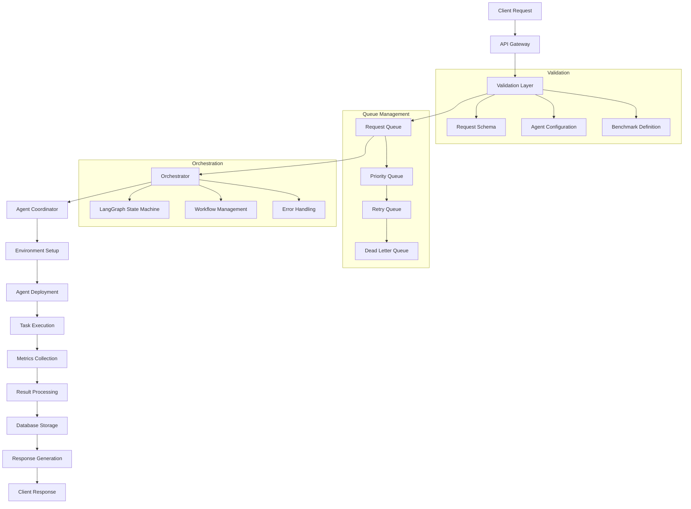
```mermaid
flowchart TD
    A[Client Request] --> B[API Gateway]
    B --> C[Validation Layer]
    C --> D[Request Queue]
    D --> E[Orchestrator]
    E --> F[Agent Coordinator]
    F --> G[Environment Setup]
    G --> H[Agent Deployment]
    H --> I[Task Execution]
    I --> J[Metrics Collection]
    J --> K[Result Processing]
    K --> L[Database Storage]
    L --> M[Response Generation]
    M --> N[Client Response]

    subgraph "Validation"
        C1[Request Schema]
        C2[Agent Configuration]
        C3[Benchmark Definition]
        C --> C1
        C --> C2
        C --> C3
    end

    subgraph "Queue Management"
        D1[Priority Queue]
        D2[Retry Queue]
        D3[Dead Letter Queue]
        D --> D1
        D1 --> D2
        D2 --> D3
    end

    subgraph "Orchestration"
        E1[LangGraph State Machine]
        E2[Workflow Management]
        E3[Error Handling]
        E --> E1
        E --> E2
        E --> E3
    end
```

### 2. Agent Execution Data Flow

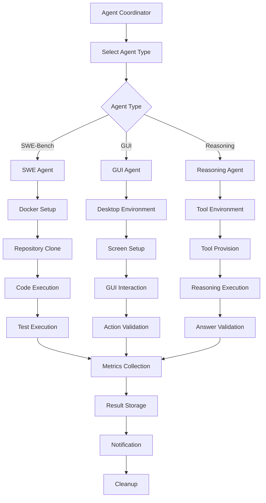
```mermaid
flowchart TD
    A[Agent Coordinator] --> B[Select Agent Type]
    B --> C{Agent Type}

    C -->|SWE-Bench| D[SWE Agent]
    C -->|GUI| E[GUI Agent]
    C -->|Reasoning| F[Reasoning Agent]

    D --> G[Docker Setup]
    E --> H[Desktop Environment]
    F --> I[Tool Environment]

    G --> J[Repository Clone]
    H --> K[Screen Setup]
    I --> L[Tool Provision]

    J --> M[Code Execution]
    K --> N[GUI Interaction]
    L --> O[Reasoning Execution]

    M --> P[Test Execution]
    N --> Q[Action Validation]
    O --> R[Answer Validation]

    P --> S[Metrics Collection]
    Q --> S
    R --> S

    S --> T[Result Storage]
    T --> U[Notification]
    U --> V[Cleanup]
```

### 3. Metrics Collection Pipeline

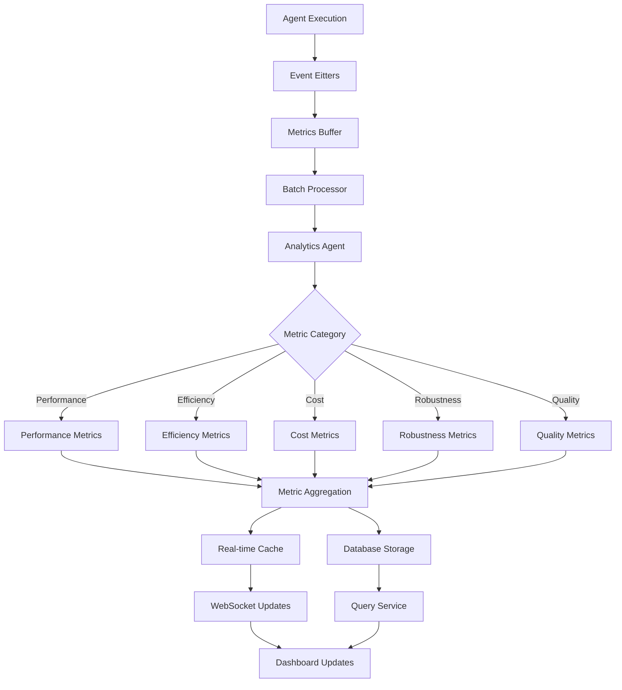
```mermaid
flowchart TD
    A[Agent Execution] --> B[Event Eitters]
    B --> C[Metrics Buffer]
    C --> D[Batch Processor]
    D --> E[Analytics Agent]

    E --> F{Metric Category}
    F -->|Performance| G[Performance Metrics]
    F -->|Efficiency| H[Efficiency Metrics]
    F -->|Cost| I[Cost Metrics]
    F -->|Robustness| J[Robustness Metrics]
    F -->|Quality| K[Quality Metrics]

    G --> L[Metric Aggregation]
    H --> L
    I --> L
    J --> L
    K --> L

    L --> M[Real-time Cache]
    L --> N[Database Storage]

    M --> O[WebSocket Updates]
    N --> P[Query Service]

    O --> Q[Dashboard Updates]
    P --> Q
```

## Real-time Data Flow

### 1. WebSocket Communication Flow

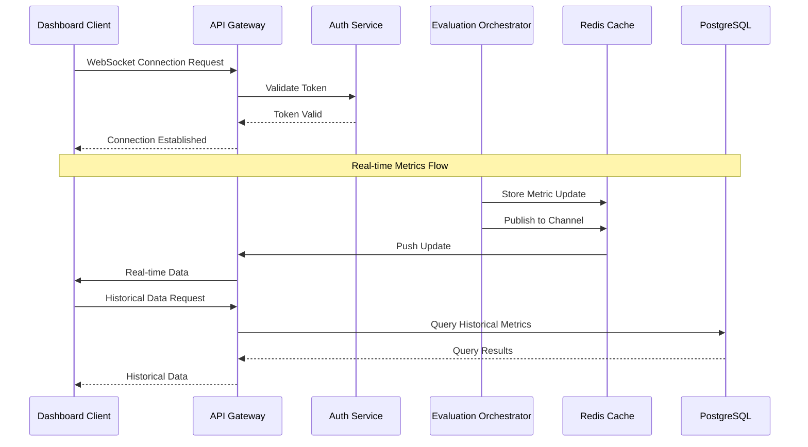
```mermaid
sequenceDiagram
    participant Client as Dashboard Client
    participant Gateway as API Gateway
    participant Auth as Auth Service
    participant Orchestrator as Evaluation Orchestrator
    participant Cache as Redis Cache
    participant DB as PostgreSQL

    Client->>Gateway: WebSocket Connection Request
    Gateway->>Auth: Validate Token
    Auth-->>Gateway: Token Valid
    Gateway-->>Client: Connection Established

    Note over Client,DB: Real-time Metrics Flow

    Orchestrator->>Cache: Store Metric Update
    Orchestrator->>Cache: Publish to Channel

    Cache->>Gateway: Push Update
    Gateway->>Client: Real-time Data

    Client->>Gateway: Historical Data Request
    Gateway->>DB: Query Historical Metrics
    DB-->>Gateway: Query Results
    Gateway-->>Client: Historical Data
```

### 2. Dashboard Data Synchronization

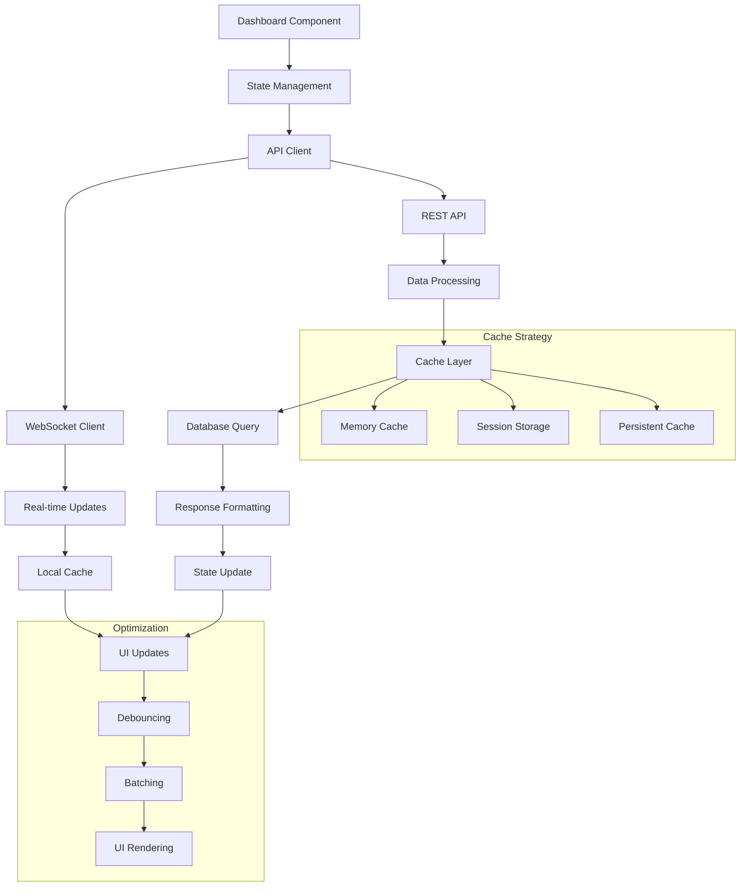
```mermaid
flowchart TD
    A[Dashboard Component] --> B[State Management]
    B --> C[API Client]
    C --> D[WebSocket Client]

    D --> E[Real-time Updates]
    E --> F[Local Cache]
    F --> G[UI Updates]

    C --> H[REST API]
    H --> I[Data Processing]
    I --> J[Cache Layer]
    J --> K[Database Query]
    K --> L[Response Formatting]
    L --> M[State Update]
    M --> G

    subgraph "Cache Strategy"
        N[Memory Cache]
        O[Session Storage]
        P[Persistent Cache]
        J --> N
        J --> O
        J --> P
    end

    subgraph "Optimization"
        Q[Debouncing]
        R[Throttling]
        R[Batching]
        G --> Q
        Q --> R
        R --> S[UI Rendering]
    end
```

## Database Data Flow

### 1. Write Operations Flow

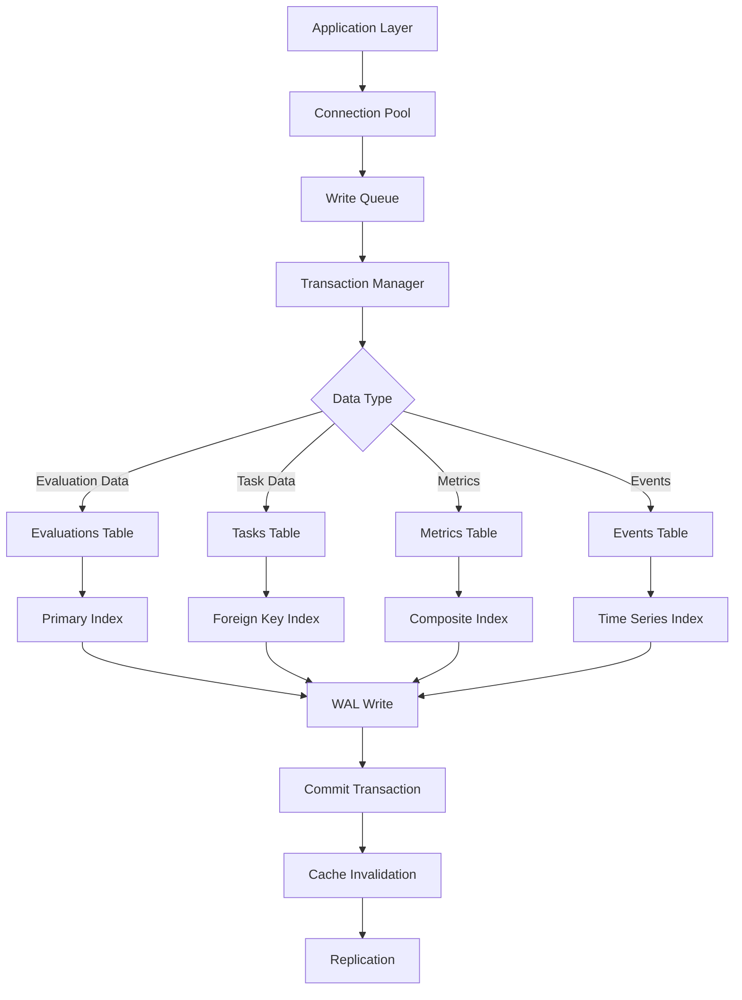
```mermaid
flowchart TD
    A[Application Layer] --> B[Connection Pool]
    B --> C[Write Queue]
    C --> D[Transaction Manager]

    D --> E{Data Type}
    E -->|Evaluation Data| F[Evaluations Table]
    E -->|Task Data| G[Tasks Table]
    E -->|Metrics| H[Metrics Table]
    E -->|Events| I[Events Table]

    F --> J[Primary Index]
    G --> K[Foreign Key Index]
    H --> L[Composite Index]
    I --> M[Time Series Index]

    J --> N[WAL Write]
    K --> N
    L --> N
    M --> N

    N --> O[Commit Transaction]
    O --> P[Cache Invalidation]
    P --> Q[Replication]
```

### 2. Read Operations Flow

```mermaid
flowchart TD
    A[Client Request] --> B[Cache Layer]
    B -->{Cache Hit?}
    B -->|Yes| C[Return Cached Data]
    B -->|No| D[Database Query]

    D --> E[Query Optimizer]
    E --> F[Index Selection]
    F --> G[Query Execution]

    G --> H[Result Processing]
    H --> I[Format Response]
    I --> J[Cache Update]
    J --> K[Return Result]

    subgraph "Query Types"
        L[Single Record]
        M[Aggregate Queries]
        N[Time Series]
        O[Joins]
        E --> L
        E --> M
        E --> N
        E --> O
    end

    subgraph "Performance Optimization"
        P[Query Plan Cache]
        Q[Result Cache]
        R[Connection Reuse]
        F --> P
        G --> Q
        D --> R
    end
```

## Error Handling Data Flow

### 1. Error Detection and Reporting

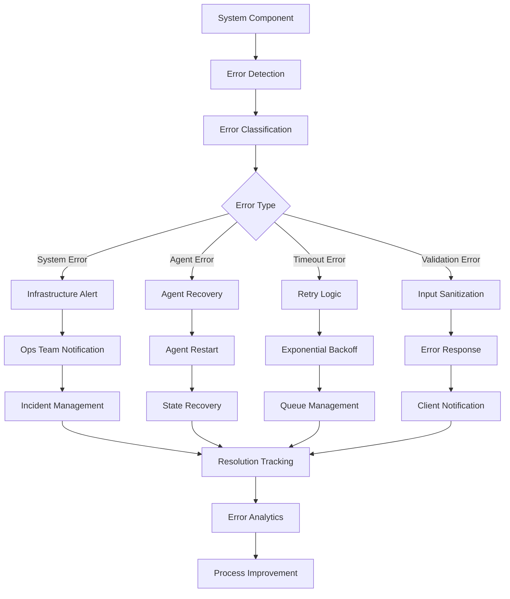
```mermaid
flowchart TD
    A[System Component] --> B[Error Detection]
    B --> C[Error Classification]
    C --> D{Error Type}

    D -->|System Error| E[Infrastructure Alert]
    D -->|Agent Error| F[Agent Recovery]
    D -->|Timeout Error| G[Retry Logic]
    D -->|Validation Error| H[Input Sanitization]

    E --> I[Ops Team Notification]
    F --> J[Agent Restart]
    G --> K[Exponential Backoff]
    H --> L[Error Response]

    I --> M[Incident Management]
    J --> N[State Recovery]
    K --> O[Queue Management]
    L --> P[Client Notification]

    M --> Q[Resolution Tracking]
    N --> Q
    O --> Q
    P --> Q

    Q --> R[Error Analytics]
    R --> S[Process Improvement]
```

### 2. Recovery and Failover Flow

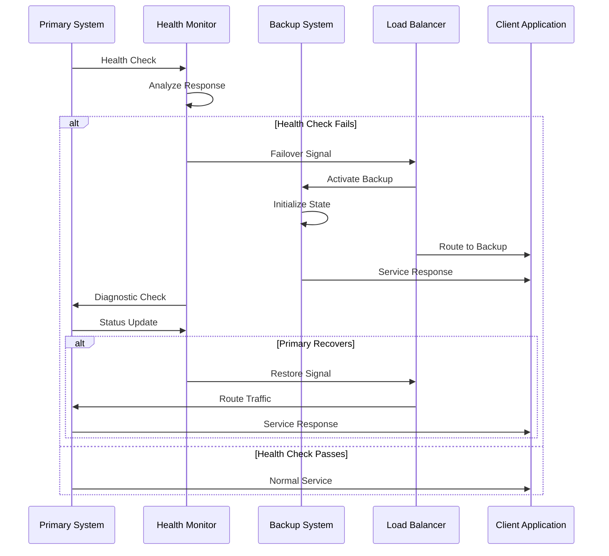
```mermaid
sequenceDiagram
    participant Primary as Primary System
    participant Monitor as Health Monitor
    participant Backup as Backup System
    participant LoadBalancer as Load Balancer
    participant Client as Client Application

    Primary->>Monitor: Health Check
    Monitor->>Monitor: Analyze Response

    alt Health Check Fails
        Monitor->>LoadBalancer: Failover Signal
        LoadBalancer->>Backup: Activate Backup
        Backup->>Backup: Initialize State
        LoadBalancer->>Client: Route to Backup
        Backup->>Client: Service Response

        Monitor->>Primary: Diagnostic Check
        Primary->>Monitor: Status Update

        alt Primary Recovers
            Monitor->>LoadBalancer: Restore Signal
            LoadBalancer->>Primary: Route Traffic
            Primary->>Client: Service Response
        end
    else Health Check Passes
        Primary->>Client: Normal Service
    end
```

## Security Data Flow

### 1. Authentication and Authorization

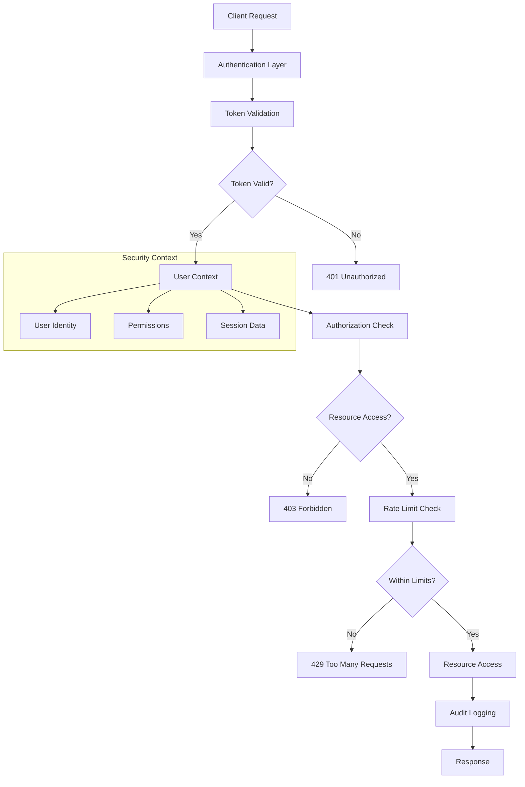
```mermaid
flowchart TD
    A[Client Request] --> B[Authentication Layer]
    B --> C[Token Validation]
    C --> D{Token Valid?}

    D -->|No| E[401 Unauthorized]
    D -->|Yes| F[User Context]

    F --> G[Authorization Check]
    G --> H{Resource Access?}

    H -->|No| I[403 Forbidden]
    H -->|Yes| J[Rate Limit Check]

    J --> K{Within Limits?}
    K -->|No| L[429 Too Many Requests]
    K -->|Yes| M[Resource Access]

    M --> N[Audit Logging]
    N --> O[Response]

    subgraph "Security Context"
        P[User Identity]
        Q[Permissions]
        R[Session Data]
        F --> P
        F --> Q
        F --> R
    end
```

### 2. Data Encryption Flow

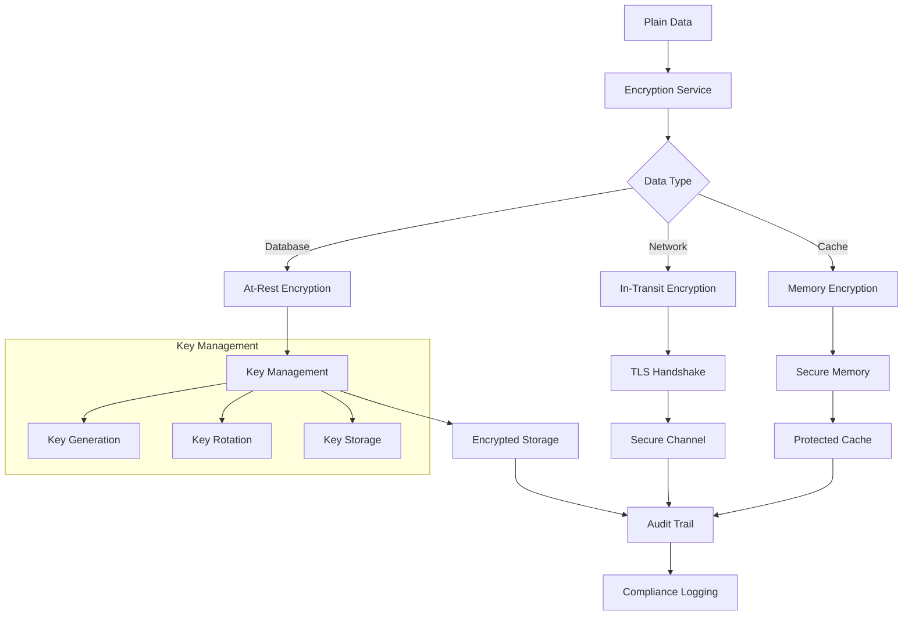
```mermaid
flowchart TD
    A[Plain Data] --> B[Encryption Service]
    B --> C{Data Type}

    C -->|Database| D[At-Rest Encryption]
    C -->|Network| E[In-Transit Encryption]
    C -->|Cache| F[Memory Encryption]

    D --> G[Key Management]
    E --> H[TLS Handshake]
    F --> I[Secure Memory]

    G --> J[Encrypted Storage]
    H --> K[Secure Channel]
    I --> L[Protected Cache]

    J --> M[Audit Trail]
    K --> M
    L --> M

    M --> N[Compliance Logging]

    subgraph "Key Management"
        O[Key Generation]
        P[Key Rotation]
        Q[Key Storage]
        G --> O
        G --> P
        G --> Q
    end
```

## Integration Data Flow

### 1. External System Integration

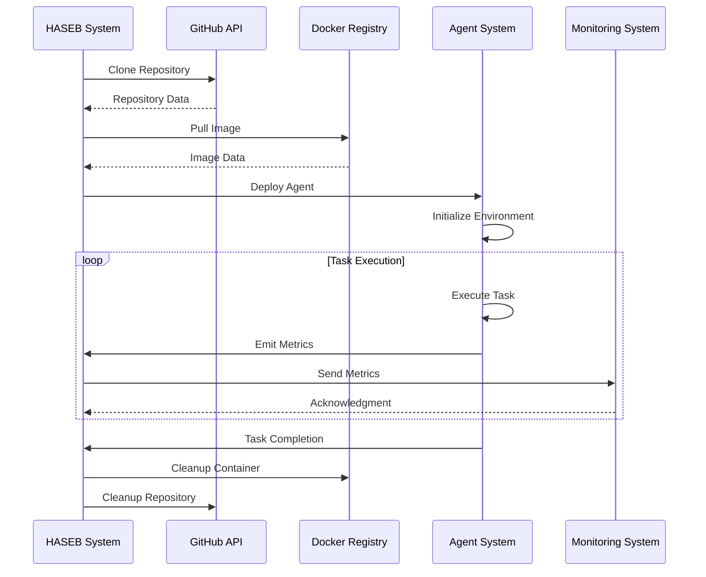
```mermaid
sequenceDiagram
    participant HASEB as HASEB System
    participant GitHub as GitHub API
    participant Docker as Docker Registry
    participant Agent as Agent System
    participant Monitoring as Monitoring System

    HASEB->>GitHub: Clone Repository
    GitHub-->>HASEB: Repository Data

    HASEB->>Docker: Pull Image
    Docker-->>HASEB: Image Data

    HASEB->>Agent: Deploy Agent
    Agent->>Agent: Initialize Environment

    loop Task Execution
        Agent->>Agent: Execute Task
        Agent->>HASEB: Emit Metrics
        HASEB->>Monitoring: Send Metrics
        Monitoring-->>HASEB: Acknowledgment
    end

    Agent->>HASEB: Task Completion
    HASEB->>Docker: Cleanup Container
    HASEB->>GitHub: Cleanup Repository
```

### 2. Third-party Service Integration

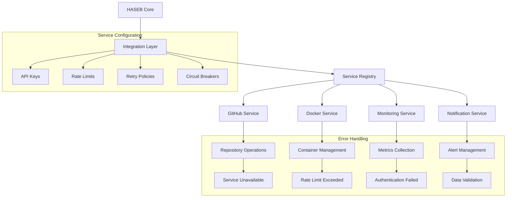
```mermaid
flowchart TD
    A[HASEB Core] --> B[Integration Layer]
    B --> C[Service Registry]

    C --> D[GitHub Service]
    C --> E[Docker Service]
    C --> F[Monitoring Service]
    C --> G[Notification Service]

    D --> H[Repository Operations]
    E --> I[Container Management]
    F --> J[Metrics Collection]
    G --> K[Alert Management]

    subgraph "Service Configuration"
        L[API Keys]
        M[Rate Limits]
        N[Retry Policies]
        O[Circuit Breakers]
        B --> L
        B --> M
        B --> N
        B --> O
    end

    subgraph "Error Handling"
        P[Service Unavailable]
        Q[Rate Limit Exceeded]
        R[Authentication Failed]
        S[Data Validation]
        H --> P
        I --> Q
        J --> R
        K --> S
    end
```

## Performance Optimization Data Flow

### 1. Caching Strategy Flow

```mermaid
flowchart TD
    A[Data Request] --> B[Cache Check]
    B -->{Cache Hit?}

    B -->|Yes| C[Return Cached Data]
    B -->|No| D[Fetch from Source]

    D --> E[Process Data]
    E --> F[Store in Cache]
    F --> G[Return Data]

    subgraph "Cache Layers"
        H[Memory Cache - L1]
        I[Redis Cache - L2]
        J[Database Cache - L3]
        B --> H
        H --> I
        I --> J
    end

    subgraph "Cache Policies"
        K[TTL Management]
        L[LRU Eviction]
        M[Cache Warming]
        N[Cache Invalidation]
        F --> K
        F --> L
        F --> M
        F --> N
    end
```

### 2. Load Balancing Flow

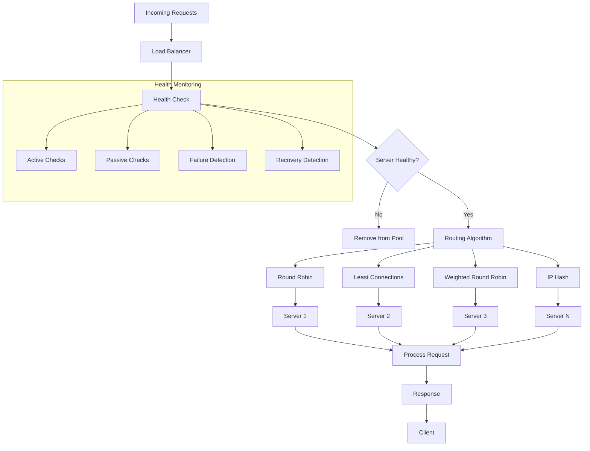
```mermaid
flowchart TD
    A[Incoming Requests] --> B[Load Balancer]
    B --> C[Health Check]
    C --> D{Server Healthy?}

    D -->|No| E[Remove from Pool]
    D -->|Yes| F[Routing Algorithm]

    F --> G[Round Robin]
    F --> H[Least Connections]
    F --> I[Weighted Round Robin]
    F --> J[IP Hash]

    G --> K[Server 1]
    H --> L[Server 2]
    I --> M[Server 3]
    J --> N[Server N]

    K --> O[Process Request]
    L --> O
    M --> O
    N --> O

    O --> P[Response]
    P --> Q[Client]

    subgraph "Health Monitoring"
        R[Active Checks]
        S[Passive Checks]
        T[Failure Detection]
        U[Recovery Detection]
        C --> R
        C --> S
        C --> T
        C --> U
    end
```

## Monitoring and Observability Flow

### 1. Metrics Collection Flow

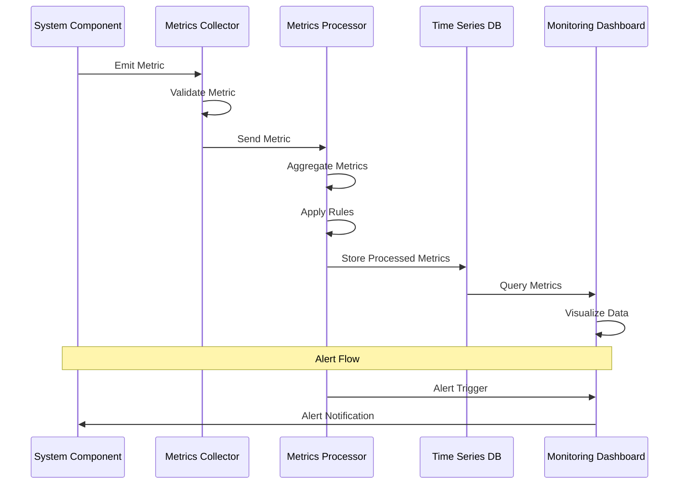
```mermaid
sequenceDiagram
    participant Component as System Component
    participant Collector as Metrics Collector
    participant Processor as Metrics Processor
    participant Storage as Time Series DB
    participant Dashboard as Monitoring Dashboard

    Component->>Collector: Emit Metric
    Collector->>Collector: Validate Metric
    Collector->>Processor: Send Metric

    Processor->>Processor: Aggregate Metrics
    Processor->>Processor: Apply Rules
    Processor->>Storage: Store Processed Metrics

    Storage->>Dashboard: Query Metrics
    Dashboard->>Dashboard: Visualize Data

    Note over Component,Dashboard: Alert Flow
    Processor->>Dashboard: Alert Trigger
    Dashboard->>Component: Alert Notification
```

### 2. Logging and Tracing Flow

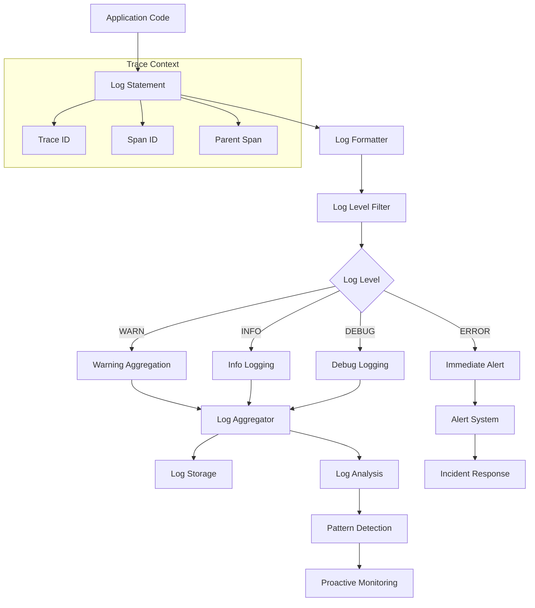
```mermaid
flowchart TD
    A[Application Code] --> B[Log Statement]
    B --> C[Log Formatter]
    C --> D[Log Level Filter]

    D --> E{Log Level}
    E -->|ERROR| F[Immediate Alert]
    E -->|WARN| G[Warning Aggregation]
    E -->|INFO| H[Info Logging]
    E -->|DEBUG| I[Debug Logging]

    F --> J[Alert System]
    G --> K[Log Aggregator]
    H --> K
    I --> K

    K --> L[Log Storage]
    K --> M[Log Analysis]

    J --> N[Incident Response]
    M --> O[Pattern Detection]
    O --> P[Proactive Monitoring]

    subgraph "Trace Context"
        Q[Trace ID]
        R[Span ID]
        S[Parent Span]
        B --> Q
        B --> R
        B --> S
    end
```

This comprehensive data flow documentation provides detailed visualization of how data moves through the HASEB system, covering all major workflows from evaluation execution to real-time dashboard updates. Each diagram is designed to help developers understand the data dependencies and optimize system performance.