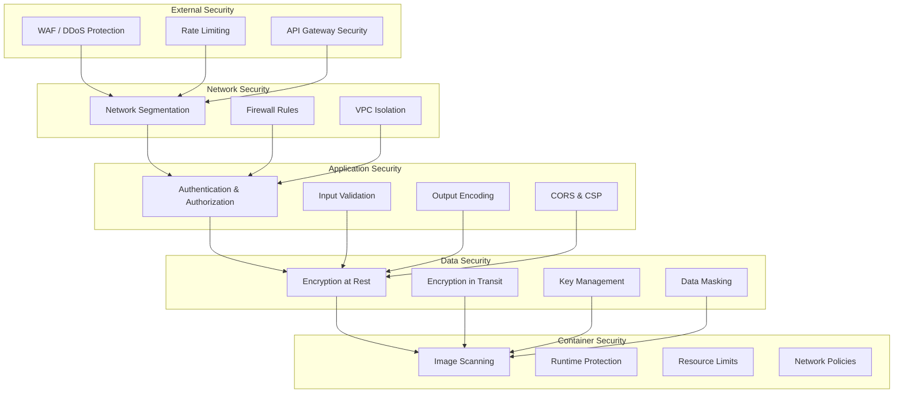

# HASEB Security and Error Handling Strategies

## Overview

This document outlines comprehensive security and error handling strategies for the HASEB (Holistic Agentic System Evaluator & Benchmarking Suite) platform. It covers security architecture, threat mitigation, error classification, recovery mechanisms, and operational best practices to ensure system reliability and data protection.

## Security Architecture

### 1. Threat Model Analysis

#### Asset Classification
| Asset | Classification | Value | Primary Threats |
|-------|----------------|-------|-----------------|
| Evaluation Results | Confidential | High | Data theft, tampering |
| Agent Configurations | Internal | Medium | Unauthorized access |
| User Credentials | Restricted | Critical | Authentication bypass |
| System Metrics | Public | Low | DoS attacks |
| API Keys | Restricted | Critical | Key compromise |
| Database | Restricted | Critical | SQL injection, data exfiltration |
| Container Images | Internal | Medium | Malicious code injection |

#### Threat Matrix
| Threat Category | Likelihood | Impact | Risk Score | Mitigation Priority |
|-----------------|------------|---------|------------|-------------------|
| SQL Injection | Medium | High | 8/10 | High |
| Authentication Bypass | Low | Critical | 7/10 | High |
| Data Exfiltration | Medium | Critical | 9/10 | Critical |
| DoS Attacks | High | Medium | 7/10 | Medium |
| Container Escape | Low | Critical | 6/10 | High |
| API Abuse | High | Medium | 7/10 | Medium |
| Insider Threat | Low | High | 6/10 | Medium |

### 2. Defense in Depth Strategy

#### Security Layers



### 3. Authentication and Authorization

#### Multi-factor Authentication Implementation
```typescript
interface AuthenticationService {
  authenticate(credentials: Credentials): Promise<AuthenticationResult>;
  verifyMFA(userId: string, mfaToken: string): Promise<MFAVerificationResult>;
  refreshToken(refreshToken: string): Promise<TokenRefreshResult>;
  revokeToken(token: string): Promise<void>;
  getUserPermissions(userId: string): Promise<Permission[]>;
}

class SecureAuthService implements AuthenticationService {
  constructor(
    private userRepository: UserRepository,
    private mfaService: MFAService,
    private tokenService: TokenService,
    private auditLogger: AuditLogger
  ) {}

  async authenticate(credentials: Credentials): Promise<AuthenticationResult> {
    const startTime = performance.now();

    try {
      // Input validation
      const validation = this.validateCredentials(credentials);
      if (!validation.isValid) {
        await this.logFailedAttempt(credentials, 'validation_failed');
        throw new AuthenticationError('Invalid credentials format');
      }

      // Rate limiting check
      const rateLimitResult = await this.checkRateLimit(credentials.username);
      if (!rateLimitResult.allowed) {
        await this.logFailedAttempt(credentials, 'rate_limit_exceeded');
        throw new AuthenticationError('Too many authentication attempts');
      }

      // User lookup and password verification
      const user = await this.userRepository.findByUsername(credentials.username);
      if (!user || !await this.verifyPassword(credentials.password, user.passwordHash)) {
        await this.logFailedAttempt(credentials, 'invalid_credentials');
        throw new AuthenticationError('Invalid username or password');
      }

      // MFA verification if enabled
      if (user.mfaEnabled) {
        return {
          success: false,
          requiresMFA: true,
          mfaSessionId: await this.mfaService.initiateChallenge(user.id),
          duration: performance.now() - startTime
        };
      }

      // Generate tokens
      const tokens = await this.tokenService.generateTokens(user);

      await this.logSuccessfulAuth(user.id);
      return {
        success: true,
        user: this.sanitizeUser(user),
        tokens,
        duration: performance.now() - startTime
      };
    } catch (error) {
      const duration = performance.now() - startTime;
      this.metrics.recordAuthenticationAttempt(false, duration);
      throw error;
    }
  }

  private async verifyPassword(password: string, hash: string): Promise<boolean> {
    const pepper = process.env.PASSWORD_PEPPER!;
    const hashedPassword = crypto.pbkdf2Sync(password + pepper, hash, 100000, 64, 'sha512');
    return hashedPassword.toString('hex') === hash;
  }

  private validateCredentials(credentials: Credentials): ValidationResult {
    const errors: string[] = [];

    if (!credentials.username || credentials.username.length < 3 || credentials.username.length > 50) {
      errors.push('Invalid username format');
    }

    if (!credentials.password || credentials.password.length < 8 || credentials.password.length > 128) {
      errors.push('Invalid password format');
    }

    return {
      isValid: errors.length === 0,
      errors
    };
  }
}
```

#### Role-Based Access Control (RBAC)
```typescript
interface Permission {
  resource: string;
  action: string;
  conditions?: Record<string, any>;
}

interface Role {
  id: string;
  name: string;
  permissions: Permission[];
  inheritsFrom?: string[];
}

class AuthorizationService {
  private roles: Map<string, Role> = new Map();
  private userRoles: Map<string, string[]> = new Map();

  constructor(private auditLogger: AuditLogger) {
    this.initializeRoles();
  }

  async hasPermission(userId: string, resource: string, action: string, context?: any): Promise<boolean> {
    const userRoles = await this.getUserRoles(userId);

    for (const roleName of userRoles) {
      const role = this.roles.get(roleName);
      if (!role) continue;

      // Check direct permissions
      const hasDirectPermission = this.checkPermission(role.permissions, resource, action, context);
      if (hasDirectPermission) {
        await this.auditLogger.logPermissionCheck(userId, resource, action, true, roleName);
        return true;
      }

      // Check inherited permissions
      if (role.inheritsFrom) {
        for (const inheritedRoleName of role.inheritsFrom) {
          const inheritedRole = this.roles.get(inheritedRoleName);
          if (inheritedRole) {
            const hasInheritedPermission = this.checkPermission(
              inheritedRole.permissions,
              resource,
              action,
              context
            );
            if (hasInheritedPermission) {
              await this.auditLogger.logPermissionCheck(userId, resource, action, true, inheritedRoleName);
              return true;
            }
          }
        }
      }
    }

    await this.auditLogger.logPermissionCheck(userId, resource, action, false);
    return false;
  }

  private checkPermission(permissions: Permission[], resource: string, action: string, context?: any): boolean {
    return permissions.some(permission => {
      if (permission.resource !== resource && permission.resource !== '*') return false;
      if (permission.action !== action && permission.action !== '*') return false;

      // Check conditions if provided
      if (permission.conditions && context) {
        return this.evaluateConditions(permission.conditions, context);
      }

      return true;
    });
  }

  private evaluateConditions(conditions: Record<string, any>, context: any): boolean {
    return Object.entries(conditions).every(([key, value]) => {
      const contextValue = this.getNestedValue(context, key);
      return this.compareValues(contextValue, value);
    });
  }

  private initializeRoles(): void {
    // Admin role
    this.roles.set('admin', {
      id: 'admin',
      name: 'Administrator',
      permissions: [
        { resource: '*', action: '*', conditions: { 'system.maintenance': false } }
      ]
    });

    // Operator role
    this.roles.set('operator', {
      id: 'operator',
      name: 'Operator',
      permissions: [
        { resource: 'evaluations', action: 'read' },
        { resource: 'evaluations', action: 'create', conditions: { 'user.quota_available': true } },
        { resource: 'evaluations', action: 'cancel', conditions: { 'evaluation.owner': 'self' } },
        { resource: 'metrics', action: 'read' },
        { resource: 'agents', action: 'read' },
        { resource: 'benchmarks', action: 'read' }
      ]
    });

    // Viewer role
    this.roles.set('viewer', {
      id: 'viewer',
      name: 'Viewer',
      permissions: [
        { resource: 'evaluations', action: 'read', conditions: { 'evaluation.visibility': 'public' } },
        { resource: 'metrics', action: 'read' },
        { resource: 'agents', action: 'read' },
        { resource: 'benchmarks', action: 'read' }
      ]
    });
  }
}
```

### 4. Input Validation and Sanitization

#### Comprehensive Input Validation
```typescript
interface ValidationRule {
  field: string;
  type: 'string' | 'number' | 'boolean' | 'array' | 'object' | 'email' | 'url' | 'uuid';
  required?: boolean;
  minLength?: number;
  maxLength?: number;
  min?: number;
  max?: number;
  pattern?: RegExp;
  sanitize?: boolean;
  custom?: (value: any) => ValidationResult;
}

class InputValidator {
  private rules: Map<string, ValidationRule[]> = new Map();

  constructor() {
    this.initializeValidationRules();
  }

  validate(endpoint: string, input: any): ValidationResult {
    const rules = this.rules.get(endpoint);
    if (!rules) {
      return { isValid: true, errors: [], sanitized: input };
    }

    const errors: string[] = [];
    const sanitized = { ...input };

    for (const rule of rules) {
      const value = input[rule.field];

      // Check required fields
      if (rule.required && (value === undefined || value === null || value === '')) {
        errors.push(`Field '${rule.field}' is required`);
        continue;
      }

      // Skip validation for optional empty fields
      if (!rule.required && (value === undefined || value === null || value === '')) {
        continue;
      }

      // Type validation
      const typeValidation = this.validateType(rule, value);
      if (!typeValidation.isValid) {
        errors.push(`Field '${rule.field}' has invalid type: ${typeValidation.error}`);
        continue;
      }

      // Length/Range validation
      if (rule.type === 'string') {
        if (rule.minLength && value.length < rule.minLength) {
          errors.push(`Field '${rule.field}' must be at least ${rule.minLength} characters`);
        }
        if (rule.maxLength && value.length > rule.maxLength) {
          errors.push(`Field '${rule.field}' must not exceed ${rule.maxLength} characters`);
        }
      }

      if (rule.type === 'number') {
        if (rule.min !== undefined && value < rule.min) {
          errors.push(`Field '${rule.field}' must be at least ${rule.min}`);
        }
        if (rule.max !== undefined && value > rule.max) {
          errors.push(`Field '${rule.field}' must not exceed ${rule.max}`);
        }
      }

      // Pattern validation
      if (rule.pattern && !rule.pattern.test(value)) {
        errors.push(`Field '${rule.field}' does not match required pattern`);
      }

      // Custom validation
      if (rule.custom) {
        const customValidation = rule.custom(value);
        if (!customValidation.isValid) {
          errors.push(`Field '${rule.field}': ${customValidation.error}`);
        }
      }

      // Sanitization
      if (rule.sanitize) {
        sanitized[rule.field] = this.sanitizeValue(value, rule.type);
      }
    }

    return {
      isValid: errors.length === 0,
      errors,
      sanitized
    };
  }

  private validateType(rule: ValidationRule, value: any): ValidationResult {
    switch (rule.type) {
      case 'string':
        return { isValid: typeof value === 'string' };
      case 'number':
        return { isValid: typeof value === 'number' && !isNaN(value) };
      case 'boolean':
        return { isValid: typeof value === 'boolean' };
      case 'array':
        return { isValid: Array.isArray(value) };
      case 'object':
        return { isValid: typeof value === 'object' && value !== null && !Array.isArray(value) };
      case 'email':
        const emailPattern = /^[^\s@]+@[^\s@]+\.[^\s@]+$/;
        return {
          isValid: typeof value === 'string' && emailPattern.test(value)
        };
      case 'url':
        try {
          new URL(value);
          return { isValid: true };
        } catch {
          return { isValid: false, error: 'Invalid URL format' };
        }
      case 'uuid':
        const uuidPattern = /^[0-9a-f]{8}-[0-9a-f]{4}-[1-5][0-9a-f]{3}-[89ab][0-9a-f]{3}-[0-9a-f]{12}$/i;
        return {
          isValid: typeof value === 'string' && uuidPattern.test(value)
        };
      default:
        return { isValid: false, error: `Unknown validation type: ${rule.type}` };
    }
  }

  private sanitizeValue(value: any, type: string): any {
    if (type === 'string') {
      // HTML sanitization
      return value
        .replace(/</g, '&lt;')
        .replace(/>/g, '&gt;')
        .replace(/"/g, '&quot;')
        .replace(/'/g, '&#x27;')
        .replace(/\//g, '&#x2F;');
    }

    if (type === 'array') {
      return value.map(item => this.sanitizeValue(item, 'object'));
    }

    if (type === 'object') {
      const sanitized: any = {};
      for (const [key, val] of Object.entries(value)) {
        sanitized[key] = this.sanitizeValue(val, 'string');
      }
      return sanitized;
    }

    return value;
  }

  private initializeValidationRules(): void {
    // Evaluation creation validation
    this.rules.set('POST:/evaluations', [
      {
        field: 'agent_name',
        type: 'string',
        required: true,
        minLength: 1,
        maxLength: 255,
        sanitize: true
      },
      {
        field: 'agent_version',
        type: 'string',
        required: true,
        minLength: 1,
        maxLength: 50,
        pattern: /^[0-9]+\.[0-9]+\.[0-9]+$/,
        sanitize: true
      },
      {
        field: 'benchmark_type',
        type: 'string',
        required: true,
        enum: ['swe-bench', 'osworld', 'webarena', 'gaia', 'agentbench']
      },
      {
        field: 'configuration',
        type: 'object',
        required: true,
        custom: (value) => {
          if (!value || typeof value !== 'object') {
            return { isValid: false, error: 'Configuration must be an object' };
          }

          const maxConcurrentTasks = value.max_concurrent_tasks;
          if (maxConcurrentTasks && (maxConcurrentTasks < 1 || maxConcurrentTasks > 50)) {
            return { isValid: false, error: 'max_concurrent_tasks must be between 1 and 50' };
          }

          return { isValid: true };
        }
      }
    ]);
  }
}
```

### 5. Container Security

#### Secure Container Configuration
```dockerfile
# Multi-stage Dockerfile with security hardening
FROM node:20-alpine AS builder

# Security: Non-root user
RUN addgroup -g 1001 -S nodejs && \
    adduser -S haseb -u 1001

WORKDIR /app

# Security: Verify package integrity
COPY package*.json ./
RUN npm ci --only=production && npm cache clean --force

COPY --chown=haseb:nodejs . .

# Security: Minimal runtime image
FROM node:20-alpine AS runtime

# Security: Update packages and remove vulnerabilities
RUN apk update && \
    apk upgrade && \
    apk add --no-cache dumb-init && \
    rm -rf /var/cache/apk/*

# Security: Remove unnecessary packages
RUN apk del --purge \
    alpine-baselayout \
    apk-tools \
    busybox-suid

# Create non-root user
RUN addgroup -g 1001 -S nodejs && \
    adduser -S haseb -u 1001

WORKDIR /app

# Security: Copy only necessary files
COPY --from=builder --chown=haseb:nodejs /app/node_modules ./node_modules
COPY --from=builder --chown=haseb:nodejs /app/package.json ./package.json
COPY --from=builder --chown=haseb:nodejs /app/dist ./dist

# Security: Switch to non-root user
USER haseb

# Security: Health check
HEALTHCHECK --interval=30s --timeout=3s --start-period=5s --retries=3 \
  CMD node dist/health-check.js

# Security: Use dumb-init as PID 1
ENTRYPOINT ["dumb-init", "--"]
CMD ["node", "dist/server.js"]
```

#### Runtime Security Policies
```yaml
# Pod Security Policy for agent containers
apiVersion: policy/v1beta1
kind: PodSecurityPolicy
metadata:
  name: haseb-agent-psp
spec:
  privileged: false
  allowPrivilegeEscalation: false
  requiredDropCapabilities:
    - ALL
  volumes:
    - 'configMap'
    - 'emptyDir'
    - 'projected'
  runAsUser:
    rule: 'MustRunAsNonRoot'
  seLinux:
    rule: 'RunAsAny'
  fsGroup:
    rule: 'RunAsAny'
  readOnlyRootFilesystem: true
  securityContext:
    runAsNonRoot: true
    runAsUser: 1001
    capabilities:
      drop:
        - ALL
```

## Error Handling Architecture

### 1. Error Classification System

#### Error Type Hierarchy
```typescript
enum ErrorSeverity {
  LOW = 'low',           // Non-critical, system continues functioning
  MEDIUM = 'medium',     // Affects specific functionality
  HIGH = 'high',         // Affects multiple components
  CRITICAL = 'critical'  // System-wide impact
}

enum ErrorCategory {
  VALIDATION = 'validation',     // Input validation errors
  AUTHENTICATION = 'authentication', // Auth failures
  AUTHORIZATION = 'authorization', // Permission errors
  BUSINESS_LOGIC = 'business_logic', // Application logic errors
  EXTERNAL_SERVICE = 'external_service', // Third-party service errors
  INFRASTRUCTURE = 'infrastructure', // System resource errors
  AGENT_EXECUTION = 'agent_execution', // Agent runtime errors
  DATA_INTEGRITY = 'data_integrity', // Data consistency errors
  NETWORK = 'network',          // Network-related errors
  TIMEOUT = 'timeout'          // Operation timeout errors
}

interface ErrorContext {
  userId?: string;
  requestId?: string;
  evaluationId?: string;
  taskId?: string;
  agentId?: string;
  component: string;
  operation: string;
  timestamp: Date;
  environment: 'development' | 'staging' | 'production';
  metadata?: Record<string, any>;
}

abstract class HASEBError extends Error {
  public readonly code: string;
  public readonly category: ErrorCategory;
  public readonly severity: ErrorSeverity;
  public readonly context: ErrorContext;
  public readonly recoverable: boolean;
  public readonly retryable: boolean;
  public readonly userMessage?: string;

  constructor(
    code: string,
    message: string,
    category: ErrorCategory,
    severity: ErrorSeverity,
    context: ErrorContext,
    options: {
      recoverable?: boolean;
      retryable?: boolean;
      userMessage?: string;
      cause?: Error;
    } = {}
  ) {
    super(message);
    this.name = this.constructor.name;
    this.code = code;
    this.category = category;
    this.severity = severity;
    this.context = context;
    this.recoverable = options.recoverable ?? true;
    this.retryable = options.retryable ?? false;
    this.userMessage = options.userMessage;

    if (options.cause) {
      this.cause = options.cause;
    }

    // Capture stack trace
    if (Error.captureStackTrace) {
      Error.captureStackTrace(this, this.constructor);
    }
  }

  toJSON(): ErrorSerialization {
    return {
      name: this.name,
      code: this.code,
      message: this.message,
      category: this.category,
      severity: this.severity,
      context: this.context,
      recoverable: this.recoverable,
      retryable: this.retryable,
      userMessage: this.userMessage,
      stack: this.stack
    };
  }
}

// Specific error types
class ValidationError extends HASEBError {
  constructor(field: string, value: any, constraint: string, context: ErrorContext) {
    super(
      'VALIDATION_ERROR',
      `Invalid value for field '${field}': ${constraint}`,
      ErrorCategory.VALIDATION,
      ErrorSeverity.LOW,
      context,
      {
        recoverable: true,
        retryable: false,
        userMessage: `Invalid input: ${field}`,
        metadata: { field, value, constraint }
      }
    );
  }
}

class AuthenticationError extends HASEBError {
  constructor(reason: string, context: ErrorContext) {
    super(
      'AUTHENTICATION_ERROR',
      `Authentication failed: ${reason}`,
      ErrorCategory.AUTHENTICATION,
      ErrorSeverity.MEDIUM,
      context,
      {
        recoverable: true,
        retryable: false,
        userMessage: 'Authentication failed',
        metadata: { reason }
      }
    );
  }
}

class AgentExecutionError extends HASEBError {
  constructor(agentId: string, task: string, error: string, context: ErrorContext) {
    super(
      'AGENT_EXECUTION_ERROR',
      `Agent ${agentId} failed to execute task '${task}': ${error}`,
      ErrorCategory.AGENT_EXECUTION,
      ErrorSeverity.MEDIUM,
      context,
      {
        recoverable: true,
        retryable: true,
        userMessage: 'Task execution failed',
        metadata: { agentId, task, originalError: error }
      }
    );
  }
}

class InfrastructureError extends HASEBError {
  constructor(component: string, operation: string, error: string, context: ErrorContext) {
    super(
      'INFRASTRUCTURE_ERROR',
      `Infrastructure error in ${component} during ${operation}: ${error}`,
      ErrorCategory.INFRASTRUCTURE,
      ErrorSeverity.HIGH,
      context,
      {
        recoverable: false,
        retryable: true,
        userMessage: 'System temporarily unavailable',
        metadata: { component, operation, originalError: error }
      }
    );
  }
}
```

### 2. Error Handling Middleware

#### Centralized Error Handler
```typescript
class ErrorHandler {
  constructor(
    private logger: Logger,
    private metrics: MetricsCollector,
    private alerting: AlertingService,
    private errorRepository: ErrorRepository
  ) {}

  async handleError(error: HASEBError): Promise<ErrorResponse> {
    // Log the error
    await this.logError(error);

    // Record metrics
    this.metrics.recordError(error);

    // Check if alerting is needed
    if (this.shouldAlert(error)) {
      await this.alerting.sendAlert(error);
    }

    // Store error for analysis
    await this.errorRepository.store(error);

    // Generate appropriate response
    return this.generateErrorResponse(error);
  }

  private async logError(error: HASEBError): Promise<void> {
    const logLevel = this.getLogLevel(error.severity);
    const logData = {
      error: error.toJSON(),
      stack: error.stack,
      systemInfo: this.getSystemInfo()
    };

    switch (logLevel) {
      case 'error':
        await this.logger.error(error.message, logData);
        break;
      case 'warn':
        await this.logger.warn(error.message, logData);
        break;
      case 'info':
        await this.logger.info(error.message, logData);
        break;
    }
  }

  private shouldAlert(error: HASEBError): boolean {
    // Alert on critical errors
    if (error.severity === ErrorSeverity.CRITICAL) {
      return true;
    }

    // Alert on infrastructure errors
    if (error.category === ErrorCategory.INFRASTRUCTURE) {
      return true;
    }

    // Alert on repeated errors
    return this.metrics.getErrorRate(error.code, '5m') > 0.1; // 10% error rate
  }

  private generateErrorResponse(error: HASEBError): ErrorResponse {
    const statusCode = this.getStatusCode(error);
    const userMessage = error.userMessage || 'An unexpected error occurred';

    return {
      success: false,
      error: {
        code: error.code,
        message: userMessage,
        recoverable: error.recoverable,
        retryable: error.retryable
      },
      metadata: {
        requestId: error.context.requestId,
        timestamp: error.context.timestamp
      }
    };
  }

  private getStatusCode(error: HASEBError): number {
    switch (error.category) {
      case ErrorCategory.VALIDATION:
        return 400;
      case ErrorCategory.AUTHENTICATION:
        return 401;
      case ErrorCategory.AUTHORIZATION:
        return 403;
      case ErrorCategory.BUSINESS_LOGIC:
        return 422;
      case ErrorCategory.TIMEOUT:
        return 408;
      case ErrorCategory.AGENT_EXECUTION:
        return 500;
      case ErrorCategory.INFRASTRUCTURE:
        return error.severity === ErrorSeverity.CRITICAL ? 503 : 500;
      default:
        return 500;
    }
  }

  private getLogLevel(severity: ErrorSeverity): 'error' | 'warn' | 'info' {
    switch (severity) {
      case ErrorSeverity.CRITICAL:
      case ErrorSeverity.HIGH:
        return 'error';
      case ErrorSeverity.MEDIUM:
        return 'warn';
      case ErrorSeverity.LOW:
        return 'info';
    }
  }
}
```

### 3. Retry and Recovery Mechanisms

#### Exponential Backoff Retry Strategy
```typescript
interface RetryConfig {
  maxAttempts: number;
  initialDelayMs: number;
  maxDelayMs: number;
  backoffMultiplier: number;
  jitter: boolean;
  retryCondition?: (error: Error) => boolean;
}

class RetryManager {
  private static readonly DEFAULT_CONFIG: RetryConfig = {
    maxAttempts: 3,
    initialDelayMs: 1000,
    maxDelayMs: 30000,
    backoffMultiplier: 2,
    jitter: true,
    retryCondition: (error) => error.retryable !== false
  };

  async executeWithRetry<T>(
    operation: () => Promise<T>,
    config: Partial<RetryConfig> = {},
    context: string = 'unknown'
  ): Promise<T> {
    const fullConfig = { ...RetryManager.DEFAULT_CONFIG, ...config };
    let lastError: Error;

    for (let attempt = 1; attempt <= fullConfig.maxAttempts; attempt++) {
      try {
        return await operation();
      } catch (error) {
        lastError = error as Error;

        // Check if we should retry
        if (attempt === fullConfig.maxAttempts ||
            !fullConfig.retryCondition!(lastError)) {
          break;
        }

        // Calculate delay
        const delay = this.calculateDelay(attempt, fullConfig);

        // Log retry attempt
        this.logger.warn(`Operation failed, retrying in ${delay}ms (attempt ${attempt}/${fullConfig.maxAttempts})`, {
          context,
          attempt,
          error: lastError.message,
          nextRetryIn: delay
        });

        // Wait before retry
        await this.sleep(delay);
      }
    }

    // All retries failed
    throw new RetryExhaustedError(
      `Operation failed after ${fullConfig.maxAttempts} attempts`,
      lastError!,
      { context, attempts: fullConfig.maxAttempts }
    );
  }

  private calculateDelay(attempt: number, config: RetryConfig): number {
    let delay = config.initialDelayMs * Math.pow(config.backoffMultiplier, attempt - 1);
    delay = Math.min(delay, config.maxDelayMs);

    // Add jitter to prevent thundering herd
    if (config.jitter) {
      delay = delay * (0.5 + Math.random() * 0.5);
    }

    return Math.floor(delay);
  }

  private sleep(ms: number): Promise<void> {
    return new Promise(resolve => setTimeout(resolve, ms));
  }
}

// Circuit breaker pattern
class CircuitBreaker {
  private state: 'closed' | 'open' | 'half-open' = 'closed';
  private failureCount = 0;
  private lastFailureTime = 0;
  private successCount = 0;

  constructor(
    private config: CircuitBreakerConfig,
    private metrics: MetricsCollector
  ) {}

  async execute<T>(operation: () => Promise<T>): Promise<T> {
    if (this.state === 'open') {
      if (this.shouldAttemptReset()) {
        this.state = 'half-open';
        this.successCount = 0;
      } else {
        throw new CircuitBreakerOpenError('Circuit breaker is open');
      }
    }

    try {
      const result = await operation();
      this.onSuccess();
      return result;
    } catch (error) {
      this.onFailure();
      throw error;
    }
  }

  private onSuccess(): void {
    if (this.state === 'half-open') {
      this.successCount++;
      if (this.successCount >= this.config.successThreshold) {
        this.reset();
      }
    } else {
      this.reset();
    }
  }

  private onFailure(): void {
    this.failureCount++;
    this.lastFailureTime = Date.now();

    if (this.failureCount >= this.config.failureThreshold) {
      this.state = 'open';
      this.metrics.recordCircuitBreakerOpen(this.config.name);
    }
  }

  private shouldAttemptReset(): boolean {
    return Date.now() - this.lastFailureTime >= this.config.timeoutMs;
  }

  private reset(): void {
    this.state = 'closed';
    this.failureCount = 0;
    this.successCount = 0;
  }
}
```

### 4. Graceful Degradation

#### Service Degradation Strategies
```typescript
interface DegradationLevel {
  level: number;
  description: string;
  actions: DegradationAction[];
}

interface DegradationAction {
  type: 'disable_feature' | 'increase_timeout' | 'reduce_precision' | 'fallback_service';
  target: string;
  parameters?: Record<string, any>;
}

class DegradationManager {
  private degradationLevels: DegradationLevel[] = [
    {
      level: 1,
      description: 'Minor performance degradation',
      actions: [
        { type: 'increase_timeout', target: 'database_queries', parameters: { multiplier: 1.5 } },
        { type: 'reduce_precision', target: 'real_time_metrics', parameters: { interval: '30s' } }
      ]
    },
    {
      level: 2,
      description: 'Moderate service degradation',
      actions: [
        { type: 'disable_feature', target: 'advanced_analytics' },
        { type: 'increase_timeout', target: 'agent_execution', parameters: { multiplier: 2 } },
        { type: 'fallback_service', target: 'metrics_cache', parameters: { fallback: 'basic_cache' } }
      ]
    },
    {
      level: 3,
      description: 'Major service degradation',
      actions: [
        { type: 'disable_feature', target: 'new_evaluations' },
        { type: 'disable_feature', target: 'real_time_updates' },
        { type: 'fallback_service', target: 'database', parameters: { fallback: 'read_replica_only' } }
      ]
    }
  ];

  private currentLevel = 0;

  constructor(
    private healthChecker: HealthChecker,
    private metrics: MetricsCollector,
    private alerting: AlertingService
  ) {
    this.startMonitoring();
  }

  private async startMonitoring(): Promise<void> {
    setInterval(async () => {
      await this.evaluateSystemHealth();
    }, 30000); // Check every 30 seconds
  }

  private async evaluateSystemHealth(): Promise<void> {
    const health = await this.healthChecker.getSystemHealth();
    const newLevel = this.calculateDegradationLevel(health);

    if (newLevel !== this.currentLevel) {
      await this.applyDegradation(newLevel);
    }
  }

  private calculateDegradationLevel(health: SystemHealth): number {
    // Calculate degradation based on various health metrics
    let score = 0;

    // Response time (weight: 30%)
    if (health.averageResponseTime > 2000) score += 30;
    else if (health.averageResponseTime > 1000) score += 20;
    else if (health.averageResponseTime > 500) score += 10;

    // Error rate (weight: 40%)
    if (health.errorRate > 0.1) score += 40;
    else if (health.errorRate > 0.05) score += 30;
    else if (health.errorRate > 0.01) score += 20;

    // Resource utilization (weight: 20%)
    if (health.cpuUtilization > 90) score += 20;
    else if (health.cpuUtilization > 80) score += 15;
    else if (health.cpuUtilization > 70) score += 10;

    // Availability (weight: 10%)
    if (health.availability < 0.99) score += 10;
    else if (health.availability < 0.995) score += 5;

    // Map score to degradation level
    if (score >= 80) return 3;
    if (score >= 50) return 2;
    if (score >= 20) return 1;
    return 0;
  }

  private async applyDegradation(newLevel: number): Promise<void> {
    const previousLevel = this.currentLevel;
    this.currentLevel = newLevel;

    const level = this.degradationLevels.find(l => l.level === newLevel);
    if (!level) return;

    this.logger.warn(`Applying degradation level ${newLevel}: ${level.description}`);

    // Apply all actions for this level
    for (const action of level.actions) {
      await this.executeDegradationAction(action);
    }

    // Send alert if degrading
    if (newLevel > previousLevel) {
      await this.alerting.sendDegradationAlert({
        previousLevel,
        newLevel,
        description: level.description,
        actions: level.actions
      });
    }

    this.metrics.recordDegradationLevel(newLevel);
  }

  private async executeDegradationAction(action: DegradationAction): Promise<void> {
    switch (action.type) {
      case 'disable_feature':
        await this.disableFeature(action.target);
        break;
      case 'increase_timeout':
        await this.increaseTimeout(action.target, action.parameters?.multiplier);
        break;
      case 'reduce_precision':
        await this.reducePrecision(action.target, action.parameters);
        break;
      case 'fallback_service':
        await this.activateFallback(action.target, action.parameters?.fallback);
        break;
    }
  }
}
```

### 5. Monitoring and Alerting

#### Security Monitoring
```typescript
class SecurityMonitor {
  constructor(
    private logger: Logger,
    private metrics: MetricsCollector,
    private alerting: AlertingService,
    private auditLogger: AuditLogger
  ) {}

  async monitorAuthenticationAttempt(attempt: AuthenticationAttempt): Promise<void> {
    // Check for suspicious patterns
    const suspicious = await this.detectSuspiciousAuthentication(attempt);

    if (suspicious) {
      await this.handleSuspiciousActivity(attempt, suspicious);
    }

    // Record metrics
    this.metrics.recordAuthenticationAttempt(attempt);

    // Log for audit
    await this.auditLogger.logAuthenticationAttempt(attempt);
  }

  private async detectSuspiciousAuthentication(attempt: AuthenticationAttempt): Promise<SuspiciousActivity | null> {
    const recentAttempts = await this.getRecentAuthenticationAttempts(attempt.username, '1h');

    // Check for too many failed attempts
    const failedAttempts = recentAttempts.filter(a => !a.success).length;
    if (failedAttempts > 10) {
      return {
        type: 'brute_force',
        severity: 'high',
        details: `${failedAttempts} failed attempts in the last hour`,
        confidence: 0.9
      };
    }

    // Check for attempts from multiple locations
    const uniqueLocations = new Set(recentAttempts.map(a => a.ipAddress)).size;
    if (uniqueLocations > 5 && failedAttempts > 3) {
      return {
        type: 'distributed_attack',
        severity: 'medium',
        details: `Attempts from ${uniqueLocations} different locations`,
        confidence: 0.7
      };
    }

    // Check for unusual timing patterns
    const timePattern = this.analyzeTimingPattern(recentAttempts);
    if (timePattern.suspicious) {
      return {
        type: 'automated_attack',
        severity: 'medium',
        details: 'Consistent timing suggests automated attack',
        confidence: timePattern.confidence
      };
    }

    return null;
  }

  private async handleSuspiciousActivity(attempt: AuthenticationAttempt, activity: SuspiciousActivity): Promise<void> {
    // Log security event
    await this.logger.warn('Suspicious authentication activity detected', {
      username: attempt.username,
      ipAddress: attempt.ipAddress,
      userAgent: attempt.userAgent,
      activity: activity
    });

    // Increment security metrics
    this.metrics.recordSecurityEvent(activity.type, activity.severity);

    // Send alert
    await this.alerting.sendSecurityAlert({
      type: 'suspicious_authentication',
      severity: activity.severity,
      username: attempt.username,
      ipAddress: attempt.ipAddress,
      details: activity.details,
      confidence: activity.confidence
    });

    // Apply automatic mitigations
    await this.applyMitigations(attempt, activity);
  }

  private async applyMitigations(attempt: AuthenticationAttempt, activity: SuspiciousActivity): Promise<void> {
    // Block IP address for severe threats
    if (activity.severity === 'high' && activity.confidence > 0.8) {
      await this.blockIPAddress(attempt.ipAddress, '1h');
    }

    // Increase authentication requirements
    if (activity.confidence > 0.7) {
      await this.requireMFA(attempt.username, '24h');
    }

    // Rate limit the user
    await this.applyRateLimit(attempt.username, '5/5m'); // 5 attempts per 5 minutes
  }

  async monitorDataAccess(access: DataAccessEvent): Promise<void> {
    // Check for unauthorized data access
    const isAuthorized = await this.verifyDataAccessAuthorization(access);
    if (!isAuthorized) {
      await this.handleUnauthorizedAccess(access);
    }

    // Check for unusual data access patterns
    const unusual = await this.detectUnusualDataAccess(access);
    if (unusual) {
      await this.handleUnusualDataAccess(access, unusual);
    }

    // Record metrics
    this.metrics.recordDataAccess(access);
  }

  private async verifyDataAccessAuthorization(access: DataAccessEvent): Promise<boolean> {
    // Verify user has permission to access this data
    const hasPermission = await this.authorizationService.checkPermission(
      access.userId,
      access.resource,
      access.action,
      access.context
    );

    // Check for time-based restrictions
    const withinTimeRestrictions = await this.checkTimeRestrictions(access.userId);

    // Check for location-based restrictions
    const withinLocationRestrictions = await this.checkLocationRestrictions(
      access.userId,
      access.ipAddress
    );

    return hasPermission && withinTimeRestrictions && withinLocationRestrictions;
  }
}
```

#### Error Rate Monitoring
```typescript
class ErrorRateMonitor {
  private errorWindows: Map<string, ErrorWindow[]> = new Map();
  private alertThresholds: Map<string, AlertThreshold> = new Map();

  constructor(
    private metrics: MetricsCollector,
    private alerting: AlertingService
  ) {
    this.initializeThresholds();
    this.startMonitoring();
  }

  private initializeThresholds(): void {
    this.alertThresholds.set('evaluation_orchestrator', {
      errorRate: 0.05,      // 5% error rate
      timeWindow: '5m',
      minErrors: 10         // At least 10 errors
    });

    this.alertThresholds.set('database', {
      errorRate: 0.01,      // 1% error rate
      timeWindow: '2m',
      minErrors: 5
    });

    this.alertThresholds.set('agent_execution', {
      errorRate: 0.15,      // 15% error rate (agents can fail)
      timeWindow: '10m',
      minErrors: 20
    });
  }

  recordError(error: HASEBError): void {
    const key = `${error.context.component}:${error.code}`;
    const now = Date.now();

    if (!this.errorWindows.has(key)) {
      this.errorWindows.set(key, []);
    }

    const window = this.errorWindows.get(key)!;
    window.push({ timestamp: now, error });

    // Clean old errors (keep last hour)
    const oneHourAgo = now - (60 * 60 * 1000);
    while (window.length > 0 && window[0].timestamp < oneHourAgo) {
      window.shift();
    }

    // Check if alerting is needed
    this.checkErrorRate(key, error.context.component);
  }

  private checkErrorRate(errorKey: string, component: string): void {
    const threshold = this.alertThresholds.get(component);
    if (!threshold) return;

    const window = this.errorWindows.get(errorKey);
    if (!window) return;

    const timeWindowMs = this.parseTimeWindow(threshold.timeWindow);
    const cutoffTime = Date.now() - timeWindowMs;

    const recentErrors = window.filter(e => e.timestamp > cutoffTime);

    if (recentErrors.length < threshold.minErrors) return;

    // Calculate total operations for this component (approximate)
    const totalOperations = this.metrics.getOperationCount(component, threshold.timeWindow);
    const errorRate = recentErrors.length / totalOperations;

    if (errorRate > threshold.errorRate) {
      this.sendErrorRateAlert(component, errorKey, errorRate, recentErrors, threshold);
    }
  }

  private async sendErrorRateAlert(
    component: string,
    errorKey: string,
    errorRate: number,
    errors: ErrorWindow[],
    threshold: AlertThreshold
  ): Promise<void> {
    const recentErrors = errors.slice(-10); // Last 10 errors for details

    await this.alerting.sendAlert({
      type: 'high_error_rate',
      severity: 'high',
      component,
      message: `High error rate detected: ${(errorRate * 100).toFixed(2)}% (${errors.length} errors in ${threshold.timeWindow})`,
      details: {
        errorKey,
        errorRate,
        threshold: threshold.errorRate,
        timeWindow: threshold.timeWindow,
        recentErrors: recentErrors.map(e => ({
          timestamp: new Date(e.timestamp),
          message: e.error.message,
          code: e.error.code,
          context: e.error.context
        }))
      }
    });
  }

  private parseTimeWindow(timeWindow: string): number {
    const match = timeWindow.match(/^(\d+)([smh])$/);
    if (!match) return 5 * 60 * 1000; // Default 5 minutes

    const value = parseInt(match[1]);
    const unit = match[2];

    switch (unit) {
      case 's': return value * 1000;
      case 'm': return value * 60 * 1000;
      case 'h': return value * 60 * 60 * 1000;
      default: return 5 * 60 * 1000;
    }
  }
}
```

## Incident Response and Recovery

### 1. Incident Response Plan

#### Incident Classification
```typescript
enum IncidentSeverity {
  P1 = 'P1', // Critical - System down, major impact
  P2 = 'P2', // High - Significant functionality lost
  P3 = 'P3', // Medium - Partial functionality affected
  P4 = 'P4'  // Low - Minor issues
}

enum IncidentStatus {
  OPEN = 'open',
  INVESTIGATING = 'investigating',
  IDENTIFIED = 'identified',
  MONITORING = 'monitoring',
  RESOLVED = 'resolved'
}

interface Incident {
  id: string;
  title: string;
  description: string;
  severity: IncidentSeverity;
  status: IncidentStatus;
  component: string;
  affectedUsers: number;
  startTime: Date;
  detectedTime: Date;
  resolvedTime?: Date;
  assignee?: string;
  tags: string[];
  timeline: IncidentEvent[];
  rootCause?: string;
  resolution?: string;
}

class IncidentManager {
  constructor(
    private alerting: AlertingService,
    private communication: CommunicationService,
    private monitoring: MonitoringService,
    private knowledgeBase: KnowledgeBase
  ) {}

  async createIncident(alert: SecurityAlert | ErrorAlert): Promise<Incident> {
    const incident: Incident = {
      id: this.generateIncidentId(),
      title: this.generateIncidentTitle(alert),
      description: alert.details || alert.message,
      severity: this.determineSeverity(alert),
      status: IncidentStatus.OPEN,
      component: alert.component || 'unknown',
      affectedUsers: await this.estimateAffectedUsers(alert),
      startTime: alert.timestamp,
      detectedTime: new Date(),
      tags: this.generateTags(alert),
      timeline: [{
        timestamp: new Date(),
        type: 'detected',
        message: 'Incident detected',
        details: alert
      }]
    };

    // Log incident creation
    await this.logIncidentEvent(incident.id, 'created', incident);

    // Notify on-call team
    await this.notifyOnCallTeam(incident);

    // Start initial investigation
    await this.startInvestigation(incident);

    return incident;
  }

  async updateIncident(incidentId: string, updates: Partial<Incident>): Promise<void> {
    const incident = await this.getIncident(incidentId);
    if (!incident) throw new Error(`Incident ${incidentId} not found`);

    const previousStatus = incident.status;
    Object.assign(incident, updates);

    // Add timeline event
    incident.timeline.push({
      timestamp: new Date(),
      type: 'updated',
      message: 'Incident updated',
      details: updates
    });

    await this.saveIncident(incident);

    // Handle status changes
    if (updates.status && updates.status !== previousStatus) {
      await this.handleStatusChange(incident, previousStatus, updates.status);
    }

    // Log update
    await this.logIncidentEvent(incidentId, 'updated', updates);
  }

  private async startInvestigation(incident: Incident): Promise<void> {
    await this.updateIncident(incident.id, {
      status: IncidentStatus.INVESTIGATING,
      assignee: await this.assignOnCallEngineer()
    });

    // Gather initial data
    const investigationData = await this.gatherInvestigationData(incident);

    // Add to timeline
    await this.addTimelineEvent(incident.id, {
      type: 'investigation_started',
      message: 'Investigation started',
      details: investigationData
    });

    // Check for similar incidents
    const similarIncidents = await this.findSimilarIncidents(incident);
    if (similarIncidents.length > 0) {
      await this.addTimelineEvent(incident.id, {
        type: 'similar_incidents_found',
        message: `Found ${similarIncidents.length} similar incidents`,
        details: { similarIncidents }
      });
    }
  }

  private async handleStatusChange(incident: Incident, previousStatus: IncidentStatus, newStatus: IncidentStatus): Promise<void> {
    switch (newStatus) {
      case IncidentStatus.IDENTIFIED:
        await this.notifyStakeholders(incident, 'incident_identified');
        break;

      case IncidentStatus.MONITORING:
        await this.notifyStakeholders(incident, 'incident_monitoring');
        break;

      case IncidentStatus.RESOLVED:
        await this.handleResolution(incident);
        break;
    }
  }

  private async handleResolution(incident: Incident): Promise<void> {
    // Calculate resolution time
    const resolutionTime = incident.resolvedTime!.getTime() - incident.startTime.getTime();

    // Create post-incident review task
    await this.createPostIncidentReview(incident, resolutionTime);

    // Update knowledge base
    await this.updateKnowledgeBase(incident);

    // Send final notification
    await this.notifyStakeholders(incident, 'incident_resolved');

    // Log resolution
    await this.logIncidentEvent(incident.id, 'resolved', {
      resolutionTime,
      totalDuration: resolutionTime
    });
  }
}
```

### 2. Disaster Recovery

#### Backup and Recovery Procedures
```typescript
interface BackupStrategy {
  name: string;
  components: string[];
  frequency: string;
  retention: string;
  encryption: boolean;
  compression: boolean;
  destination: string;
}

class DisasterRecoveryManager {
  private backupStrategies: BackupStrategy[] = [
    {
      name: 'database_full_backup',
      components: ['postgresql'],
      frequency: 'daily',
      retention: '30d',
      encryption: true,
      compression: true,
      destination: 's3://haseb-backups/database'
    },
    {
      name: 'config_backup',
      components: ['kubernetes_config', 'application_config'],
      frequency: 'hourly',
      retention: '7d',
      encryption: true,
      compression: true,
      destination: 's3://haseb-backups/config'
    },
    {
      name: 'metrics_backup',
      components: ['prometheus_data'],
      frequency: 'daily',
      retention: '90d',
      encryption: true,
      compression: true,
      destination: 's3://haseb-backups/metrics'
    }
  ];

  constructor(
    private storageService: StorageService,
    private databaseService: DatabaseService,
    private kubernetesService: KubernetesService,
    private alerting: AlertingService
  ) {
    this.startScheduledBackups();
  }

  async performBackup(strategyName: string): Promise<BackupResult> {
    const strategy = this.backupStrategies.find(s => s.name === strategyName);
    if (!strategy) {
      throw new Error(`Backup strategy ${strategyName} not found`);
    }

    const startTime = Date.now();
    const backupId = this.generateBackupId();

    try {
      this.logger.info(`Starting backup: ${strategyName}`, { backupId });

      const results: ComponentBackupResult[] = [];

      for (const component of strategy.components) {
        const result = await this.backupComponent(component, strategy, backupId);
        results.push(result);
      }

      const duration = Date.now() - startTime;
      const success = results.every(r => r.success);

      const backupResult: BackupResult = {
        backupId,
        strategy: strategyName,
        startTime: new Date(startTime),
        endTime: new Date(),
        duration,
        success,
        components: results,
        totalSize: results.reduce((sum, r) => sum + r.sizeBytes, 0),
        encrypted: strategy.encryption,
        compressed: strategy.compression
      };

      // Log backup result
      await this.logBackupResult(backupResult);

      // Send alert if backup failed
      if (!success) {
        await this.alerting.sendAlert({
          type: 'backup_failure',
          severity: 'high',
          message: `Backup ${strategyName} failed`,
          details: backupResult
        });
      }

      return backupResult;
    } catch (error) {
      const duration = Date.now() - startTime;

      await this.alerting.sendAlert({
        type: 'backup_failure',
        severity: 'critical',
        message: `Backup ${strategyName} failed with error`,
        details: { error: error.message, duration }
      });

      throw error;
    }
  }

  async performRecovery(backupId: string, targetEnvironment: 'production' | 'staging'): Promise<RecoveryResult> {
    const startTime = Date.now();
    const recoveryId = this.generateRecoveryId();

    try {
      this.logger.info(`Starting recovery from backup: ${backupId}`, { recoveryId, targetEnvironment });

      // Get backup details
      const backup = await this.getBackupDetails(backupId);
      if (!backup) {
        throw new Error(`Backup ${backupId} not found`);
      }

      // Validate backup integrity
      const integrityCheck = await this.validateBackupIntegrity(backup);
      if (!integrityCheck.valid) {
        throw new Error(`Backup integrity check failed: ${integrityCheck.reason}`);
      }

      // Create recovery plan
      const recoveryPlan = await this.createRecoveryPlan(backup, targetEnvironment);

      // Execute recovery steps
      const results: RecoveryStepResult[] = [];
      for (const step of recoveryPlan.steps) {
        const result = await this.executeRecoveryStep(step, recoveryId);
        results.push(result);

        if (!result.success) {
          throw new Error(`Recovery step failed: ${step.name}`);
        }
      }

      // Verify recovery
      const verification = await this.verifyRecovery(recoveryPlan, targetEnvironment);
      if (!verification.success) {
        throw new Error(`Recovery verification failed: ${verification.issues.join(', ')}`);
      }

      const duration = Date.now() - startTime;
      const recoveryResult: RecoveryResult = {
        recoveryId,
        backupId,
        targetEnvironment,
        startTime: new Date(startTime),
        endTime: new Date(),
        duration,
        success: true,
        steps: results,
        verification
      };

      await this.logRecoveryResult(recoveryResult);
      await this.alerting.sendAlert({
        type: 'recovery_completed',
        severity: 'info',
        message: `Recovery completed successfully in environment ${targetEnvironment}`,
        details: recoveryResult
      });

      return recoveryResult;
    } catch (error) {
      const duration = Date.now() - startTime;

      await this.alerting.sendAlert({
        type: 'recovery_failure',
        severity: 'critical',
        message: `Recovery failed: ${error.message}`,
        details: { backupId, targetEnvironment, duration, error: error.message }
      });

      throw error;
    }
  }

  private async executeRecoveryStep(step: RecoveryStep, recoveryId: string): Promise<RecoveryStepResult> {
    const startTime = Date.now();

    try {
      switch (step.type) {
        case 'database_restore':
          return await this.restoreDatabase(step, recoveryId);

        case 'config_restore':
          return await this.restoreConfiguration(step, recoveryId);

        case 'service_restart':
          return await this.restartService(step, recoveryId);

        case 'data_validation':
          return await this.validateData(step, recoveryId);

        default:
          throw new Error(`Unknown recovery step type: ${step.type}`);
      }
    } catch (error) {
      return {
        stepName: step.name,
        success: false,
        duration: Date.now() - startTime,
        error: error.message
      };
    }
  }
}
```

## Conclusion

This comprehensive security and error handling strategy ensures that HASEB maintains high security standards and operational reliability. Key features include:

1. **Defense in Depth**: Multiple security layers from network to application
2. **Comprehensive Error Classification**: Structured approach to error handling
3. **Automated Recovery**: Self-healing capabilities with circuit breakers and retries
4. **Graceful Degradation**: Service continues operating even during partial failures
5. **Real-time Monitoring**: Proactive detection of security threats and performance issues
6. **Incident Response**: Structured approach to handling and resolving incidents
7. **Disaster Recovery**: Automated backup and recovery procedures

The system is designed to handle failures gracefully while maintaining security and data integrity, ensuring continuous operation even under adverse conditions.