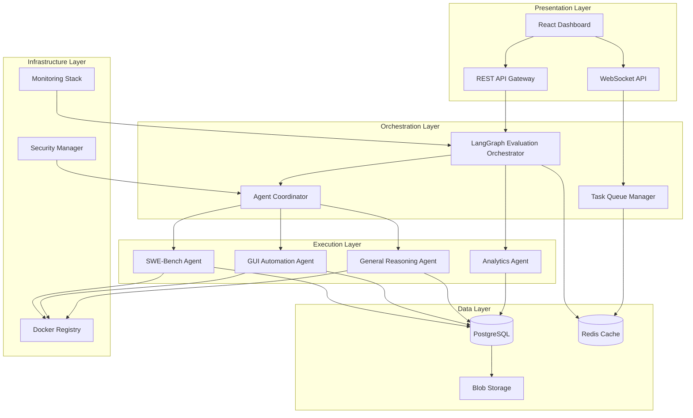
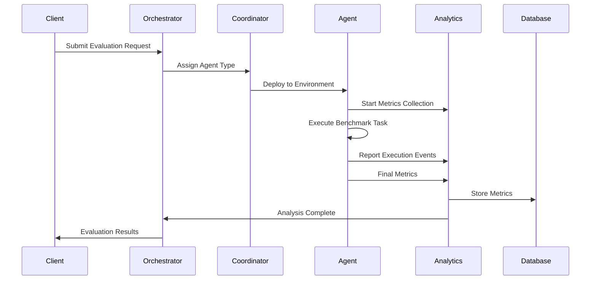
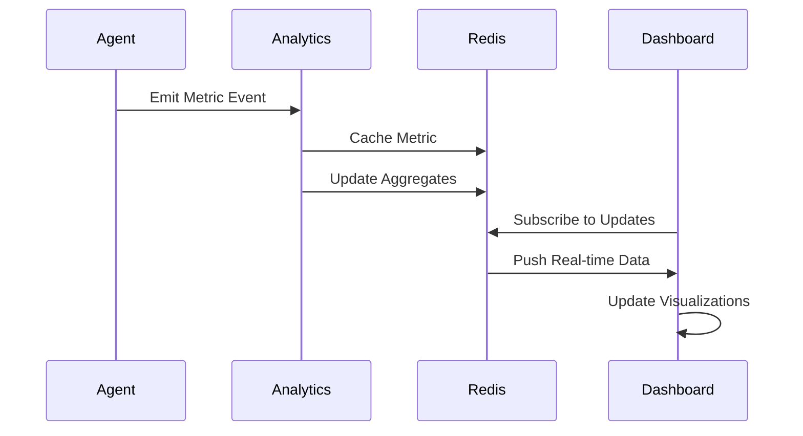

# HASEB System Architecture Documentation

## Overview

**HASEB** (Holistic Agentic System Evaluator & Benchmarking Suite) is a comprehensive evaluation platform designed to holistically assess agentic systems across diverse tasks with multi-dimensional "process viability" metrics. This architecture provides a modular, scalable foundation for evaluating AI agent performance across multiple benchmark environments.

## Architecture Principles

### Core Design Principles
1. **Modularity**: Each component is independently replaceable and testable
2. **Scalability**: Horizontal scaling for parallel evaluation execution
3. **Extensibility**: Easy addition of new benchmark environments and metrics
4. **Observability**: Comprehensive monitoring and real-time metrics collection
5. **Reliability**: Fault-tolerant design with graceful degradation
6. **Testability**: Every component is thoroughly tested with comprehensive coverage

### Quality Attributes
- **Performance**: <2s evaluation setup time, <100ms dashboard latency
- **Reliability**: 99.9% uptime with automatic recovery mechanisms
- **Scalability**: Support for 100+ concurrent evaluations
- **Security**: Agent sandboxing with secure communication protocols
- **Maintainability**: Clean architecture with clear separation of concerns

## System Architecture Diagram



## Component Architecture

### 1. Evaluation Orchestration Core (LangGraph)

**Purpose**: Master control plane for the entire evaluation suite using LangGraph stateful workflows.

**Key Features**:
- Complex, stateful evaluation workflows
- Environment setup and teardown management
- Parallel execution coordination
- Real-time metrics collection
- Error handling and recovery

**Implementation Details**:
```typescript
interface EvaluationState {
  agent: AgentConfiguration;
  benchmark: BenchmarkDefinition;
  environment: EnvironmentSetup;
  metrics: MetricsCollection;
  status: EvaluationStatus;
  error?: Error;
}

class EvaluationOrchestrator {
  private graph: StateGraph<EvaluationState>;

  constructor() {
    this.graph = new StateGraph(EvaluationState)
      .addNode("setup", this.setupEnvironment)
      .addNode("execute", this.executeTask)
      .addNode("collect", this.collectMetrics)
      .addNode("analyze", this.analyzeResults)
      .addNode("teardown", this.cleanupEnvironment)
      .addEdge("setup", "execute")
      .addEdge("execute", "collect")
      .addEdge("collect", "analyze")
      .addEdge("analyze", "teardown")
      .setEntryPoint("setup");
  }

  async runEvaluation(agent: AgentConfiguration, benchmark: BenchmarkDefinition): Promise<EvaluationResult> {
    const initialState: EvaluationState = {
      agent,
      benchmark,
      environment: {},
      metrics: {},
      status: "pending"
    };

    return await this.graph.compile().invoke(initialState);
  }
}
```

### 2. Multi-Environment Execution Agents

#### SWE-Bench Agent
**Purpose**: Manages code generation benchmark evaluations.

**Responsibilities**:
- Docker image management for SWE-bench tasks
- GitHub repository state preparation
- Code modification monitoring
- Unit test execution and validation
- Patch generation and assessment

**Interface Definition**:
```typescript
interface SWEBenchAgent {
  setupEnvironment(task: SWEBenchTask): Promise<EnvironmentSetup>;
  executeAgent(agent: Agent, task: SWEBenchTask): Promise<ExecutionResult>;
  validatePatch(patch: CodePatch, tests: TestSuite): Promise<ValidationResult>;
  collectMetrics(execution: ExecutionResult): Promise<SWEBenchMetrics>;
}
```

#### GUI Automation Agent
**Purpose**: Handles GUI-based environment evaluations (OSWorld, WebArena).

**Responsibilities**:
- Virtual desktop environment management
- Screen perception and action monitoring
- Task presentation to agent-under-test
- Action sequence validation
- GUI interaction success determination

**Interface Definition**:
```typescript
interface GUIAutomationAgent {
  createDesktopEnvironment(config: DesktopConfig): Promise<DesktopEnvironment>;
  presentTask(environment: DesktopEnvironment, task: GUITask): Promise<void>;
  monitorActions(agent: Agent): Promise<ActionSequence>;
  validateCompletion(actions: ActionSequence, task: GUITask): Promise<CompletionResult>;
  collectMetrics(actions: ActionSequence): Promise<GUIMetrics>;
}
```

#### General Reasoning Agent
**Purpose**: Manages general-purpose agent benchmarks (GAIA, AgentBench).

**Responsibilities**:
- Multi-step reasoning task execution
- Tool provisioning and environment access
- Answer validation against ground truth
- Reasoning path analysis
- Knowledge integration assessment

**Interface Definition**:
```typescript
interface GeneralReasoningAgent {
  setupEnvironment(task: ReasoningTask): Promise<ReasoningEnvironment>;
  provideTools(environment: ReasoningEnvironment): Promise<ToolSet>;
  executeAgent(agent: Agent, task: ReasoningTask): Promise<ReasoningResult>;
  validateAnswer(result: ReasoningResult, groundTruth: GroundTruth): Promise<ValidationResult>;
  collectMetrics(result: ReasoningResult): Promise<ReasoningMetrics>;
}
```

### 3. Multi-Dimensional Metrics Collection

#### Analytics Agent
**Purpose**: Comprehensive metrics collection and analysis beyond binary success/failure.

**Metrics Categories**:

##### Performance Metrics
- Task Success Rate (traditional binary outcome)
- Task Completion Percentage
- Quality Score Assessment

##### Efficiency Metrics
- Total Execution Time
- Latency per Step
- Number of Steps/Tool Calls
- Resource Utilization

##### Cost Metrics
- Total LLM Tokens (input/output)
- Estimated API Cost in USD
- Compute Resource Usage
- Storage Consumption

##### Robustness Metrics
- Tool Call Error Rate
- Recovery Rate
- Error Classification
- Failure Mode Analysis

##### Quality Metrics
- Tool Selection Accuracy
- Parameter Accuracy
- Reasoning Coherence
- Solution Elegance

**Implementation Details**:
```typescript
interface MetricsCollection {
  performance: PerformanceMetrics;
  efficiency: EfficiencyMetrics;
  cost: CostMetrics;
  robustness: RobustnessMetrics;
  quality: QualityMetrics;
}

interface AnalyticsAgent {
  collectMetrics(execution: ExecutionResult, category: MetricCategory): Promise<MetricValue>;
  aggregateMetrics(metrics: MetricsCollection[]): Promise<AggregatedMetrics>;
  generateInsights(metrics: AggregatedMetrics): Promise<InsightReport>;
  compareResults(baseline: MetricsCollection, current: MetricsCollection): Promise<ComparisonReport>;
}
```

## Data Flow Architecture

### Evaluation Workflow Flow



### Real-time Metrics Flow



## Database Schema Design

### PostgreSQL Schema

#### Core Tables

```sql
-- Evaluations table stores high-level evaluation metadata
CREATE TABLE evaluations (
    id UUID PRIMARY KEY DEFAULT gen_random_uuid(),
    agent_name VARCHAR(255) NOT NULL,
    agent_version VARCHAR(50) NOT NULL,
    benchmark_type VARCHAR(100) NOT NULL,
    benchmark_version VARCHAR(50) NOT NULL,
    status VARCHAR(50) NOT NULL CHECK (status IN ('pending', 'running', 'completed', 'failed', 'cancelled')),
    created_at TIMESTAMP WITH TIME ZONE DEFAULT NOW(),
    started_at TIMESTAMP WITH TIME ZONE,
    completed_at TIMESTAMP WITH TIME ZONE,
    configuration JSONB NOT NULL,
    metadata JSONB,

    -- Indexes for common queries
    INDEX idx_evaluations_agent_benchmark (agent_name, benchmark_type),
    INDEX idx_evaluations_status_created (status, created_at),
    INDEX idx_evaluations_created_desc (created_at DESC)
);

-- Tasks table stores individual task execution data
CREATE TABLE tasks (
    id UUID PRIMARY KEY DEFAULT gen_random_uuid(),
    evaluation_id UUID NOT NULL REFERENCES evaluations(id) ON DELETE CASCADE,
    task_id VARCHAR(255) NOT NULL,
    task_name TEXT NOT NULL,
    task_type VARCHAR(100) NOT NULL,
    status VARCHAR(50) NOT NULL CHECK (status IN ('pending', 'running', 'completed', 'failed', 'timeout')),
    started_at TIMESTAMP WITH TIME ZONE,
    completed_at TIMESTAMP WITH TIME ZONE,
    configuration JSONB NOT NULL,
    result JSONB,
    error_message TEXT,

    -- Unique constraint to prevent duplicate tasks
    UNIQUE(evaluation_id, task_id),

    -- Indexes for performance
    INDEX idx_tasks_evaluation_status (evaluation_id, status),
    INDEX idx_tasks_type_status (task_type, status)
);

-- Metrics table stores detailed metrics for each task
CREATE TABLE metrics (
    id UUID PRIMARY KEY DEFAULT gen_random_uuid(),
    task_id UUID NOT NULL REFERENCES tasks(id) ON DELETE CASCADE,
    metric_category VARCHAR(50) NOT NULL CHECK (metric_category IN ('performance', 'efficiency', 'cost', 'robustness', 'quality')),
    metric_name VARCHAR(100) NOT NULL,
    metric_value NUMERIC NOT NULL,
    metric_unit VARCHAR(50),
    timestamp TIMESTAMP WITH TIME ZONE DEFAULT NOW(),
    metadata JSONB,

    -- Unique constraint to prevent duplicate metrics
    UNIQUE(task_id, metric_category, metric_name),

    -- Indexes for efficient querying
    INDEX idx_metrics_task_category (task_id, metric_category),
    INDEX idx_metrics_category_name (metric_category, metric_name),
    INDEX idx_metrics_timestamp (timestamp)
);

-- Execution events table stores detailed execution timeline
CREATE TABLE execution_events (
    id UUID PRIMARY KEY DEFAULT gen_random_uuid(),
    task_id UUID NOT NULL REFERENCES tasks(id) ON DELETE CASCADE,
    event_type VARCHAR(100) NOT NULL,
    event_data JSONB NOT NULL,
    timestamp TIMESTAMP WITH TIME ZONE DEFAULT NOW(),
    sequence_number BIGINT NOT NULL,

    -- Indexes for timeline queries
    INDEX idx_execution_events_task_timestamp (task_id, timestamp),
    INDEX idx_execution_events_type_timestamp (event_type, timestamp)
);

-- Agents table stores agent configuration and metadata
CREATE TABLE agents (
    id UUID PRIMARY KEY DEFAULT gen_random_uuid(),
    name VARCHAR(255) NOT NULL UNIQUE,
    version VARCHAR(50) NOT NULL,
    type VARCHAR(100) NOT NULL,
    configuration JSONB NOT NULL,
    capabilities JSONB,
    created_at TIMESTAMP WITH TIME ZONE DEFAULT NOW(),
    updated_at TIMESTAMP WITH TIME ZONE DEFAULT NOW(),

    -- Indexes for agent lookup
    INDEX idx_agents_name_version (name, version),
    INDEX idx_agents_type (type)
);

-- Benchmarks table stores benchmark definitions
CREATE TABLE benchmarks (
    id UUID PRIMARY KEY DEFAULT gen_random_uuid(),
    name VARCHAR(255) NOT NULL UNIQUE,
    version VARCHAR(50) NOT NULL,
    type VARCHAR(100) NOT NULL,
    description TEXT,
    configuration JSONB NOT NULL,
    task_count INTEGER NOT NULL,
    created_at TIMESTAMP WITH TIME ZONE DEFAULT NOW(),

    -- Indexes for benchmark lookup
    INDEX idx_benchmarks_name_version (name, version),
    INDEX idx_benchmarks_type (type)
);
```

#### Optimized Views

```sql
-- Aggregated metrics view for dashboard queries
CREATE VIEW aggregated_metrics AS
SELECT
    e.id as evaluation_id,
    e.agent_name,
    e.benchmark_type,
    m.metric_category,
    m.metric_name,
    AVG(m.metric_value) as avg_value,
    MIN(m.metric_value) as min_value,
    MAX(m.metric_value) as max_value,
    STDDEV(m.metric_value) as stddev_value,
    COUNT(*) as sample_count
FROM evaluations e
JOIN tasks t ON e.id = t.evaluation_id
JOIN metrics m ON t.id = m.task_id
WHERE e.status = 'completed'
GROUP BY e.id, e.agent_name, e.benchmark_type, m.metric_category, m.metric_name;

-- Performance summary view for leaderboards
CREATE VIEW performance_summary AS
SELECT
    e.agent_name,
    e.agent_version,
    e.benchmark_type,
    COUNT(*) as total_tasks,
    COUNT(CASE WHEN t.status = 'completed' THEN 1 END) as completed_tasks,
    COUNT(CASE WHEN m.metric_name = 'task_success_rate' AND m.metric_value = 1.0 THEN 1 END) as successful_tasks,
    AVG(CASE WHEN m.metric_name = 'total_execution_time' THEN m.metric_value END) as avg_execution_time,
    AVG(CASE WHEN m.metric_name = 'total_llm_tokens' THEN m.metric_value END) as avg_token_usage,
    AVG(CASE WHEN m.metric_name = 'estimated_api_cost' THEN m.metric_value END) as avg_cost
FROM evaluations e
JOIN tasks t ON e.id = t.evaluation_id
LEFT JOIN metrics m ON t.id = m.task_id
WHERE e.status = 'completed'
GROUP BY e.agent_name, e.agent_version, e.benchmark_type;
```

## API Specifications

### REST API Endpoints

#### Evaluation Management

```typescript
// Submit new evaluation
POST /api/v1/evaluations
{
  agent_name: string;
  agent_version: string;
  benchmark_type: string;
  benchmark_version: string;
  configuration: object;
}

// Get evaluation status
GET /api/v1/evaluations/{evaluation_id}

// List evaluations with filtering
GET /api/v1/evaluations?agent={agent}&benchmark={benchmark}&status={status}&limit={limit}&offset={offset}

// Cancel running evaluation
DELETE /api/v1/evaluations/{evaluation_id}

// Get evaluation results
GET /api/v1/evaluations/{evaluation_id}/results
```

#### Metrics and Analytics

```typescript
// Get aggregated metrics
GET /api/v1/metrics/aggregated?evaluation_id={id}&category={category}&metric={metric}

// Get time series metrics
GET /api/v1/metrics/timeseries?evaluation_id={id}&start_time={start}&end_time={end}&interval={interval}

// Get performance comparisons
GET /api/v1/metrics/comparison?agents={agent1,agent2}&benchmark={benchmark}&metrics={metrics}

// Get leaderboard data
GET /api/v1/leaderboard?benchmark={benchmark}&metric={metric}&limit={limit}
```

#### Agent and Benchmark Management

```typescript
// List available agents
GET /api/v1/agents

// Get agent details
GET /api/v1/agents/{agent_name}

// List available benchmarks
GET /api/v1/benchmarks

// Get benchmark details
GET /api/v1/benchmarks/{benchmark_name}
```

### WebSocket API

#### Real-time Events

```typescript
// Connect to evaluation stream
WS /api/v1/evaluations/{evaluation_id}/stream

// Event types
interface EvaluationEvent {
  type: 'evaluation_started' | 'evaluation_completed' | 'task_started' | 'task_completed' | 'metric_update' | 'error';
  data: any;
  timestamp: string;
  evaluation_id: string;
  task_id?: string;
}

// Metric update event
interface MetricUpdateEvent extends EvaluationEvent {
  type: 'metric_update';
  data: {
    task_id: string;
    metric_category: string;
    metric_name: string;
    metric_value: number;
    timestamp: string;
  };
}
```

## Component Interface Definitions

### Core Interfaces

```typescript
// Base agent interface
interface Agent {
  name: string;
  version: string;
  type: AgentType;
  capabilities: string[];
  configuration: AgentConfiguration;
  execute(task: Task, environment: Environment): Promise<TaskResult>;
}

// Base task interface
interface Task {
  id: string;
  type: TaskType;
  name: string;
  description: string;
  configuration: TaskConfiguration;
  expected_output?: any;
  time_limit?: number;
}

// Base environment interface
interface Environment {
  id: string;
  type: EnvironmentType;
  configuration: EnvironmentConfiguration;
  setup(): Promise<void>;
  execute(agent: Agent, task: Task): Promise<ExecutionResult>;
  cleanup(): Promise<void>;
}

// Metrics collection interface
interface MetricsCollector {
  collect(category: MetricCategory, name: string, value: number, unit?: string, metadata?: any): void;
  collectBatch(metrics: MetricData[]): void;
  flush(): Promise<void>;
}
```

### Agent Communication Protocol

```typescript
// Agent-to-orchestrator communication
interface AgentMessage {
  id: string;
  type: 'status_update' | 'metric_data' | 'completion' | 'error';
  agent_id: string;
  task_id: string;
  timestamp: string;
  data: any;
}

// Orchestrator-to-agent communication
interface OrchestratorMessage {
  id: string;
  type: 'start_task' | 'pause_task' | 'cancel_task' | 'update_config';
  agent_id: string;
  task_id?: string;
  timestamp: string;
  data: any;
}
```

## Technology Stack Justification

### Backend Technologies

#### Node.js with TypeScript
- **Choice**: Primary backend runtime
- **Justification**:
  - Excellent async/await support for concurrent operations
  - Rich ecosystem for AI/ML integrations
  - Strong typing with TypeScript for reliability
  - Large talent pool and community support
- **Alternatives Considered**: Python (better ML ecosystem but slower runtime), Go (faster but less ecosystem)

#### LangGraph
- **Choice**: Orchestration framework for evaluation workflows
- **Justification**:
  - Native support for complex, stateful workflows
  - Built-in error handling and recovery mechanisms
  - Excellent for multi-step evaluation processes
  - Integrates well with modern AI frameworks
- **Alternatives Considered**: Temporal (more complex), custom workflow engine (more maintenance)

#### Express.js
- **Choice**: Web framework for REST API
- **Justification**:
  - Mature and battle-tested
  - Excellent middleware ecosystem
  - Simple and flexible routing
  - Good TypeScript support
- **Alternatives Considered**: Fastify (faster but less ecosystem), Koa (more modern but less support)

#### PostgreSQL
- **Choice**: Primary database for structured data
- **Justification**:
  - ACID compliance for data integrity
  - Excellent JSONB support for flexible schema
  - Strong indexing and query optimization
  - Good scalability and replication support
- **Alternatives Considered**: MongoDB (more flexible but less ACID), MySQL (good but less JSON support)

#### Redis
- **Choice**: Caching and session management
- **Justification**:
  - Excellent performance for in-memory operations
  - Rich data structures for complex caching
  - Good pub/sub capabilities for real-time updates
  - Persistent options for durability
- **Alternatives Considered**: Memcached (simpler but fewer features), custom caching (more maintenance)

### Frontend Technologies

#### React with TypeScript
- **Choice**: Frontend framework for dashboard
- **Justification**:
  - Component-based architecture for modularity
  - Strong TypeScript support
  - Excellent ecosystem for data visualization
  - Good performance with virtual DOM
- **Alternatives Considered**: Vue.js (simpler but less ecosystem), Angular (more opinionated)

#### Chart.js / D3.js
- **Choice**: Data visualization libraries
- **Justification**:
  - Rich chart types for metrics visualization
  - Good performance with large datasets
  - Customizable and extensible
  - Strong community support
- **Alternatives Considered**: Plotly (more features but heavier), custom canvas (more control)

### Infrastructure Technologies

#### Docker
- **Choice**: Containerization for agent environments
- **Justification**:
  - Excellent isolation for security
  - Consistent environments across platforms
  - Easy scaling and deployment
  - Good integration with orchestration tools
- **Alternatives Considered**: Podman (more secure but less ecosystem), VMs (more isolation but heavier)

## Performance and Scalability Considerations

### Horizontal Scaling Strategy

#### Evaluation Processing
- **Approach**: Containerized agents orchestrated by Kubernetes
- **Scaling Metrics**: CPU utilization, memory usage, queue length
- **Auto-scaling**: Horizontal pod autoscaler based on evaluation queue depth
- **Load Balancing**: Round-robin with health checks

#### Database Scaling
- **Read Scaling**: Read replicas for dashboard queries
- **Write Scaling**: Connection pooling with PgBouncer
- **Partitioning**: Time-based partitioning for metrics tables
- **Sharding**: Agent-based sharding for large deployments

#### Caching Strategy
- **Hot Data**: Redis cache for frequently accessed metrics
- **Cold Data**: Lazy loading with cache warming
- **Cache Invalidation**: TTL-based with manual invalidation
- **Cache Sizing**: Auto-scaling based on hit rate

### Performance Optimization

#### Database Optimization
```sql
-- Optimized indexes for common query patterns
CREATE INDEX CONCURRENTLY idx_evaluations_agent_benchmark_status
ON evaluations(agent_name, benchmark_type, status)
WHERE status IN ('running', 'pending');

-- Partial indexes for recent data
CREATE INDEX CONCURRENTLY idx_metrics_recent
ON metrics(timestamp, task_id)
WHERE timestamp > NOW() - INTERVAL '7 days';

-- Composite indexes for dashboard queries
CREATE INDEX CONCURRENTLY idx_metrics_task_category_name
ON metrics(task_id, metric_category, metric_name);
```

#### Application Optimization
- **Connection Pooling**: Reuse database connections efficiently
- **Batch Processing**: Process metrics in batches to reduce overhead
- **Async Processing**: Non-blocking I/O for all external operations
- **Memory Management**: Stream large datasets to avoid memory pressure

#### Monitoring and Alerting
- **Performance Metrics**: Response time, throughput, error rate
- **Resource Metrics**: CPU, memory, disk, network utilization
- **Business Metrics**: Evaluation success rate, agent performance
- **Alert Thresholds**: Configurable thresholds with escalation

### Capacity Planning

#### Expected Load
- **Concurrent Evaluations**: 100 evaluations
- **Evaluation Duration**: 5-30 minutes average
- **Metrics per Evaluation**: 500-2000 data points
- **Dashboard Users**: 50 concurrent users

#### Resource Requirements
- **Application Servers**: 4 cores, 8GB RAM per instance
- **Database**: 8 cores, 32GB RAM, SSD storage
- **Cache**: 4 cores, 16GB RAM
- **Load Balancer**: 2 cores, 4GB RAM

## Security and Error Handling Strategies

### Security Architecture

#### Agent Sandboxing
- **Container Isolation**: Each agent runs in isolated Docker container
- **Network Segmentation**: Limited network access per agent type
- **Resource Limits**: CPU, memory, and disk quotas per container
- **File System**: Read-only base layers with temporary write layers

#### Authentication and Authorization
- **API Authentication**: JWT tokens with refresh mechanism
- **Role-Based Access**: Admin, operator, and viewer roles
- **API Rate Limiting**: Per-user rate limits to prevent abuse
- **Audit Logging**: Comprehensive audit trail for all actions

#### Data Protection
- **Encryption at Rest**: Database encryption with transparent data encryption
- **Encryption in Transit**: TLS 1.3 for all communications
- **Secret Management**: HashiCorp Vault for sensitive data
- **Data Retention**: Configurable retention policies with automatic cleanup

### Error Handling Strategy

#### Error Classification
```typescript
enum ErrorType {
  SYSTEM_ERROR = 'system_error',      // Infrastructure failures
  AGENT_ERROR = 'agent_error',        // Agent execution failures
  BENCHMARK_ERROR = 'benchmark_error', // Benchmark configuration errors
  TIMEOUT_ERROR = 'timeout_error',    // Execution timeouts
  VALIDATION_ERROR = 'validation_error' // Input validation errors
}

enum ErrorSeverity {
  LOW = 'low',         // Non-critical, can be retried
  MEDIUM = 'medium',   // Affects single evaluation
  HIGH = 'high',       // Affects multiple evaluations
  CRITICAL = 'critical' // System-wide impact
}
```

#### Error Recovery Mechanisms
- **Automatic Retry**: Exponential backoff for transient errors
- **Circuit Breaker**: Prevent cascade failures
- **Fallback Mechanisms**: Alternative execution paths
- **Manual Recovery**: Operator intervention for critical errors

#### Monitoring and Alerting
- **Error Tracking**: Comprehensive error logging and tracking
- **Alert Integration**: Integration with monitoring systems
- **Error Dashboard**: Real-time error visualization
- **Root Cause Analysis**: Automated error correlation and analysis

### Disaster Recovery

#### Backup Strategy
- **Database Backups**: Continuous WAL archiving with daily snapshots
- **Configuration Backups**: Version-controlled configuration management
- **State Recovery**: Ability to recover running evaluations
- **Testing**: Regular disaster recovery testing

#### High Availability
- **Redundancy**: Multi-zone deployment for critical components
- **Failover**: Automatic failover with minimal downtime
- **Load Balancing**: Geographic load balancing for global access
- **Health Checks**: Comprehensive health monitoring

## Implementation Roadmap

### Phase 1: Foundation (Weeks 1-2)
1. **Project Setup**
   - Initialize monorepo structure
   - Set up development environment
   - Configure CI/CD pipeline
   - Implement basic logging and monitoring

2. **Core Infrastructure**
   - Database schema implementation
   - Basic API framework setup
   - Authentication and authorization
   - Error handling foundation

### Phase 2: Core Components (Weeks 3-6)
1. **Evaluation Orchestrator**
   - LangGraph workflow implementation
   - Basic agent coordination
   - Task queue management
   - Metrics collection foundation

2. **Database Layer**
   - PostgreSQL schema implementation
   - Data access layer
   - Migration scripts
   - Basic queries and views

### Phase 3: Agent Implementation (Weeks 7-10)
1. **SWE-Bench Agent**
   - Docker integration
   - GitHub repository management
   - Test execution framework
   - Metrics collection

2. **GUI Automation Agent**
   - Desktop environment setup
   - Screen perception implementation
   - Action monitoring
   - Completion validation

3. **General Reasoning Agent**
   - Tool provisioning
   - Task execution framework
   - Answer validation
   - Reasoning metrics

### Phase 4: Analytics and Dashboard (Weeks 11-14)
1. **Analytics Agent**
   - Multi-dimensional metrics collection
   - Data aggregation and analysis
   - Insight generation
   - Comparison tools

2. **React Dashboard**
   - Real-time visualization
   - Interactive charts and graphs
   - Leaderboard functionality
   - User management

### Phase 5: Integration and Testing (Weeks 15-16)
1. **System Integration**
   - End-to-end workflow testing
   - Performance optimization
   - Security validation
   - Documentation completion

2. **Production Readiness**
   - Load testing and optimization
   - Security audit and hardening
   - Deployment automation
   - Monitoring and alerting

## Validation Criteria

### Functional Requirements
- [ ] All agent types can execute benchmarks successfully
- [ ] Metrics collection captures all required data points
- [ ] Dashboard provides real-time updates
- [ ] System supports parallel evaluation execution
- [ ] Error handling covers all failure scenarios

### Performance Requirements
- [ ] Evaluation setup time < 2 seconds
- [ ] Dashboard response time < 100ms
- [ ] Support for 100+ concurrent evaluations
- [ ] 99.9% uptime availability
- [ ] Database query optimization for dashboard loads

### Security Requirements
- [ ] Agent sandboxing prevents system access
- [ ] All communications encrypted in transit
- [ ] Data at rest encrypted
- [ ] Authentication and authorization implemented
- [ ] Audit logging for all actions

### Scalability Requirements
- [ ] Horizontal scaling support for all components
- [ ] Database partitioning for large datasets
- [ ] Caching strategy for performance
- [ ] Auto-scaling configuration
- [ ] Resource usage optimization

## Conclusion

This architecture provides a comprehensive foundation for the HASEB evaluation platform, addressing all key requirements:

1. **Modular Design**: Each component is independently replaceable and testable
2. **Scalability**: Horizontal scaling support for large-scale evaluations
3. **Extensibility**: Easy addition of new benchmark environments and metrics
4. **Reliability**: Comprehensive error handling and recovery mechanisms
5. **Security**: Agent sandboxing and secure communication protocols
6. **Performance**: Optimized for real-time metrics collection and dashboard updates

The architecture follows industry best practices and provides clear implementation guidance for the development team. The modular nature allows for incremental development and testing, while the comprehensive documentation ensures consistent implementation across all components.

The next steps involve creating detailed implementation plans for each component, beginning with the core orchestration layer and progressing through the specialized agents and analytics components. This architecture will serve as the foundation for building a world-class agentic system evaluation platform.