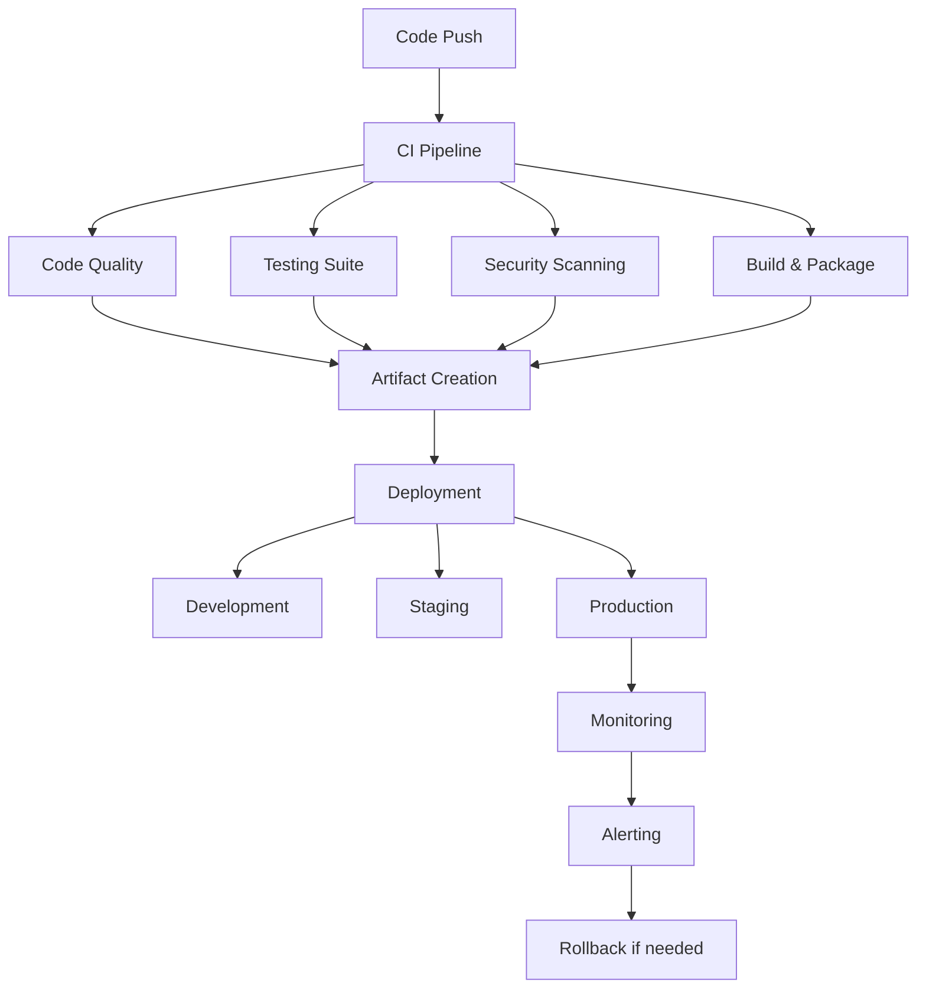

# 🚀 HASEB CI/CD Documentation

This directory contains comprehensive documentation for HASEB's CI/CD pipelines, workflows, and deployment procedures.

## 📋 Table of Contents

- [🏗️ Architecture Overview](#architecture-overview)
- [🔄 Workflow Types](#workflow-types)
- [🚀 Deployment Environments](#deployment-environments)
- [🔧 Configuration](#configuration)
- [📊 Monitoring & Alerting](#monitoring--alerting)
- [🛠️ Troubleshooting](#troubleshooting)
- [🔒 Security](#security)
- [📚 Best Practices](#best-practices)

## 🏗️ Architecture Overview

The HASEB CI/CD system is built on GitHub Actions and follows a comprehensive DevOps approach:



## 🔄 Workflow Types

### 1. Main CI/CD Pipeline (`ci-cd.yml`)
**Trigger**: Push to main/develop, Pull requests
**Purpose**: Complete build, test, and deployment pipeline

**Jobs**:
- `code-quality`: ESLint, Prettier, TypeScript checks
- `build`: Compile and package application
- `integration-tests`: API and database tests
- `e2e-tests`: Browser automation tests
- `performance-tests`: Performance benchmarks
- `security-scan`: Security vulnerability scanning
- `deploy-dev`: Development environment deployment
- `deploy-staging`: Staging environment deployment

### 2. Code Quality Automation (`code-quality.yml`)
**Trigger**: Push to main/develop, Pull requests, Daily schedule
**Purpose**: Comprehensive code analysis and quality checks

**Jobs**:
- `code-analysis`: ESLint, Prettier, TypeScript analysis
- `complexity-analysis`: Code complexity metrics
- `dependency-analysis`: Security audit and outdated packages
- `style-check`: Code style consistency
- `performance-analysis`: Lighthouse CI performance tests
- `quality-gates`: Quality threshold enforcement

### 3. Testing Automation (`testing.yml`)
**Trigger**: Push to main/develop, Pull requests, Daily schedule
**Purpose**: Comprehensive test suite execution

**Jobs**:
- `unit-tests`: Jest unit tests with coverage
- `integration-tests`: API integration tests
- `e2e-tests`: Playwright end-to-end tests
- `performance-tests`: Performance benchmarks
- `security-tests`: Security testing
- `accessibility-tests`: Accessibility compliance
- `cross-browser-tests`: Multi-browser compatibility
- `visual-regression-tests`: Visual comparison tests

### 4. Release Automation (`release.yml`)
**Trigger**: Push to main, Manual dispatch
**Purpose**: Automated versioning and release management

**Jobs**:
- `version-check`: Semantic version analysis
- `build-and-test`: Pre-release validation
- `changelog`: Automated changelog generation
- `create-release`: GitHub release creation
- `docker-release`: Docker image publishing
- `deploy-production`: Production deployment
- `update-docs`: Documentation updates

### 5. Database & Infrastructure (`database.yml`)
**Trigger**: Database changes, Manual dispatch
**Purpose**: Database migrations and infrastructure management

**Jobs**:
- `schema-validation`: Database schema validation
- `migration-testing`: Migration testing
- `database-backup`: Automated backups
- `performance-analysis`: Database performance
- `infrastructure-validation`: IaC validation
- `environment-provisioning`: Environment setup

### 6. Monitoring & Notifications (`monitoring.yml`)
**Trigger**: Push, Pull requests, Schedule, Manual
**Purpose**: Application monitoring and alerting

**Jobs**:
- `performance-monitoring`: Lighthouse performance checks
- `availability-monitoring`: Uptime monitoring
- `resource-monitoring`: System resource monitoring
- `log-monitoring`: Log analysis
- `custom-metrics`: Application-specific metrics
- `alert-checks`: Alert threshold monitoring
- `dashboard-update`: Monitoring dashboard updates

### 7. Security Scanning (`security.yml`)
**Trigger**: Push, Pull requests, Daily schedule
**Purpose**: Comprehensive security analysis

**Jobs**:
- `code-security`: CodeQL, Semgrep, Snyk analysis
- `dependency-security`: npm audit, Snyk dependency scan
- `container-security`: Docker image scanning with Trivy
- `infrastructure-security`: Terraform/Kubernetes security
- `web-security`: OWASP ZAP, Nikto web scanning
- `security-score`: Security scoring system
- `security-gates`: Security policy enforcement

### 8. Deployment (`deploy.yml`)
**Trigger**: Push, Tags, Manual dispatch
**Purpose**: Multi-environment deployment management

**Jobs**:
- `pre-deployment-checks`: Deployment validation
- `build-artifacts`: Build deployment packages
- `deploy-development`: Development deployment
- `deploy-staging`: Staging deployment
- `deploy-production`: Production deployment
- `rollback-management`: Automatic rollback
- `deployment-summary`: Deployment reporting

## 🚀 Deployment Environments

### Development Environment
- **URL**: `https://dev.haseb.example.com`
- **Purpose**: Development and feature testing
- **Trigger**: Push to develop branch
- **Database**: Test database with sample data
- **Monitoring**: Basic monitoring enabled

### Staging Environment
- **URL**: `https://staging.haseb.example.com`
- **Purpose**: Pre-production testing
- **Trigger**: Push to main branch, Manual
- **Database**: Production-like data
- **Monitoring**: Full monitoring enabled
- **Requirements**: All tests must pass

### Production Environment
- **URL**: `https://haseb.example.com`
- **Purpose**: Live application
- **Trigger**: Manual approval, Tags
- **Database**: Production database
- **Monitoring**: Comprehensive monitoring
- **Requirements**: All checks pass, team approval

## 🔧 Configuration

### Required Secrets

```yaml
# Registry and Deployment
GITHUB_TOKEN: GitHub authentication token
DOCKER_REGISTRY: Container registry credentials
DEPLOY_SSH_KEY: SSH key for server deployment

# Database
DATABASE_URL: Production database connection
TEST_DATABASE_URL: Test database connection

# Security
SNYK_TOKEN: Snyk security scanning token
CODEQL_TOKEN: CodeQL analysis token

# Monitoring
SLACK_WEBHOOK_URL: Slack notifications
SENTRY_DSN: Error tracking
PROMETHEUS_TOKEN: Metrics collection

# External Services
PERCY_TOKEN: Visual testing token
AWS_ACCESS_KEY_ID: AWS credentials
AWS_SECRET_ACCESS_KEY: AWS credentials
```

### Environment Variables

```yaml
# Application
NODE_VERSION: '20'
REGISTRY: ghcr.io
IMAGE_NAME: ${{ github.repository }}

# Quality Gates
COVERAGE_THRESHOLD: 80
QUALITY_SCORE_THRESHOLD: 80
SECURITY_SCORE_THRESHOLD: 70

# Performance
RESPONSE_TIME_THRESHOLD: 3000ms
AVAILABILITY_THRESHOLD: 99%
```

## 📊 Monitoring & Alerting

### Monitoring Dashboards

1. **Performance Dashboard**
   - Response times
   - Error rates
   - Throughput metrics
   - User experience scores

2. **Infrastructure Dashboard**
   - CPU, memory, disk usage
   - Network performance
   - Container health
   - Database metrics

3. **Security Dashboard**
   - Vulnerability counts
   - Security scores
   - Threat indicators
   - Compliance status

### Alert Channels

- **Slack**: #deployments, #alerts, #security
- **Email**: Team notifications
- **PagerDuty**: Critical incidents
- **GitHub**: Status checks and PR comments

### Alert Thresholds

```yaml
Performance:
  response_time_p95: 2000ms
  error_rate: 1%
  availability: 99.9%

Security:
  critical_vulnerabilities: 0
  security_score: 70+

Infrastructure:
  cpu_usage: 80%
  memory_usage: 85%
  disk_usage: 90%
```

## 🛠️ Troubleshooting

### Common Issues

#### 1. Build Failures
**Symptoms**: Compilation errors, missing dependencies
**Solutions**:
- Check `package.json` for correct dependencies
- Verify Node.js version compatibility
- Review build logs for specific errors
- Check for syntax errors in TypeScript files

#### 2. Test Failures
**Symptoms**: Unit/integration/e2e test failures
**Solutions**:
- Review test logs for failure details
- Check environment configuration
- Verify test data setup
- Run tests locally to reproduce issues

#### 3. Deployment Failures
**Symptoms**: Deployment to environment fails
**Solutions**:
- Check environment health and availability
- Verify credentials and permissions
- Review deployment logs
- Check resource constraints

#### 4. Security Scan Failures
**Symptoms**: Security vulnerabilities detected
**Solutions**:
- Review security scan reports
- Update vulnerable dependencies
- Fix code security issues
- Review and update security policies

### Debug Commands

```bash
# Check workflow status
gh run list --repo $REPO --limit 10

# View workflow logs
gh run view --repo $REPO --log $RUN_ID

# Debug failed jobs
gh run view --repo $REPO --job $JOB_ID --log

# Download artifacts
gh run download --repo $REPO --run $RUN_ID

# Trigger manual workflow
gh workflow run workflow_name.yml --repo $REPO

# Check environment protection rules
gh api repos/$REPO/environments/production
```

### Recovery Procedures

#### 1. Rollback Deployment
```bash
# Identify previous stable version
git log --oneline -10

# Rollback to previous commit
git revert HEAD

# Trigger rollback deployment
gh workflow run deploy.yml --field environment=production --field force_deploy=true
```

#### 2. Emergency Shutdown
```bash
# Stop running services
docker-compose down

# Scale down to zero
kubectl scale deployment haseb --replicas=0

# Update load balancer to point to maintenance page
```

#### 3. Data Recovery
```bash
# Restore database from backup
pg_restore --clean --if-exists -d haseb backup.sql

# Verify data integrity
npm run db:verify
```

## 🔒 Security

### Security Measures

1. **Code Security**
   - Static analysis with CodeQL and Semgrep
   - Secret scanning and detection
   - Dependency vulnerability scanning
   - Security gates enforcement

2. **Infrastructure Security**
   - Container image scanning
   - Terraform security validation
   - Kubernetes security policies
   - Network security rules

3. **Deployment Security**
   - Environment-specific secrets management
   - Role-based access control
   - Audit logging
   - Automated security testing

### Security Best Practices

- Regular security scans and updates
- Principle of least privilege
- Automated vulnerability patching
- Security training for team members
- Incident response procedures

## 📚 Best Practices

### Development Workflow

1. **Feature Development**
   ```bash
   # Create feature branch
   git checkout -b feature/new-feature

   # Make changes and commit
   git add .
   git commit -m "feat: add new feature"

   # Push and create PR
   git push origin feature/new-feature
   ```

2. **Code Review Process**
   - All changes require PR review
   - Automated checks must pass
   - Security review for sensitive changes
   - Performance impact assessment

3. **Testing Strategy**
   - Unit tests for all functions
   - Integration tests for API endpoints
   - E2E tests for critical user flows
   - Performance tests for new features

### Deployment Strategy

1. **Progressive Deployment**
   - Development → Staging → Production
   - Automated testing at each stage
   - Manual approval for production
   - Monitoring and rollback readiness

2. **Release Management**
   - Semantic versioning
   - Automated changelog generation
   - Tag-based releases
   - Rollback procedures

### Monitoring Strategy

1. **Proactive Monitoring**
   - Real-time metrics collection
   - Automated alerting
   - Performance trend analysis
   - Predictive analytics

2. **Incident Response**
   - Automated incident detection
   - Team notification procedures
   - Incident documentation
   - Post-incident analysis

## 📞 Support

For CI/CD issues and questions:

- **Documentation**: This guide and workflow files
- **Team Communication**: Slack #devops channel
- **Issue Tracking**: GitHub Issues with `ci-cd` label
- **Emergency Contact**: On-call DevOps engineer

---

*Last updated: $(date +%Y-%m-%d)*
*Version: 1.0.0*